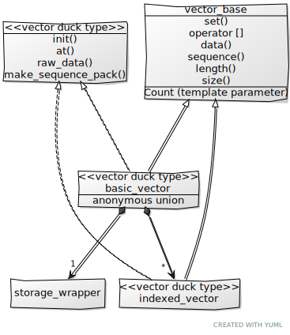

# dsga: Data Structures for Geometric Algorithms

dsga is a c\+\+20 library that implements/will implement the vectors and matrices from the [OpenGL Shading Language 4.6 specification](https://www.khronos.org/registry/OpenGL/specs/gl/GLSLangSpec.4.60.pdf). This library was not intended to be used for rendering. My requirements in general are for things like 3D CAD/CAM applications and other geometric things.

## Quick Peek

``` c++
auto perpendicular(const vec2 &some_vec)
{
    return some_vec.yx * vec2(-1, 1);
}

auto my_dot(const dvec3 &v1, const dvec3 &v2)
{
    return v1.x*v2.x + v1.y*v2.y + v1.z*v2.z;
}

// no coincident point or collinear checking
auto project_point_to_line(const dvec3 &p0, const dvec3 &p1, const dvec3 &point_in_space)
{
    auto v1 = p1 - p0;
    auto vq = point_in_space - p0;
    auto t = my_dot(vq, v1) / my_dot(v1, v1);

    return p1 + t * v1;
}

```

## Installation

Currently this is a single header library with a single file dependency, so I guess a two header library. All you need to do is include [dsga.hxx](https://raw.githubusercontent.com/davidbrowne/dsga/main/dsga.hxx). The functions are in the ```dsga``` namespace.

We now depend on [cxcm.hxx](https://raw.githubusercontent.com/davidbrowne/cxcm/main/cxcm.hxx) where the functions are in the [cxcm](https://github.com/davidbrowne/cxcm) namespace. A copy of this file is in this repository.


## Motivation

I wanted to expand the point/vector class that we use at work. We have x, y, and z data members, but that is the only way to get at the data. I wanted something more flexible that would use contiguous memory like an array, but still be useful with x, y, z data member access. I specifically did *NOT* want accessor functions as the way to get x, y, and z data. I wanted data member access.

After reading a [blog](https://t0rakka.silvrback.com/simd-scalar-accessor) about this very type of issue, I started thinking more about this, and how to deal with unions and their common initial sequence. I saw some confusion about the common initial sequence, and I based my implementation on what I read in these discussions:
* [Language lawyers: unions and "common initial sequence"](https://www.reddit.com/r/cpp_questions/comments/7ktrrj/language_lawyers_unions_and_common_initial/)
* [Union common initial sequence with primitive](https://stackoverflow.com/questions/43655657/union-common-initial-sequence-with-primitive)
* [Do scalar members in a union count towards the common initial sequence?](https://stackoverflow.com/questions/48209179/do-scalar-members-in-a-union-count-towards-the-common-initial-sequence)
* [Are there any guarantees for unions that contain a wrapped type and the type itself?](https://stackoverflow.com/questions/48058545/are-there-any-guarantees-for-unions-that-contain-a-wrapped-type-and-the-type-its)

Once I understood these issues, I decided I wanted to try and get as much vector and matrix functionality I could with this approach. That is why in the end I decided to implement the vectors and matrices from the [OpenGL Shading Language 4.6 specification](https://www.khronos.org/registry/OpenGL/specs/gl/GLSLangSpec.4.60.pdf). dsga's implementation doesn't care about data-packing or rendering.

I also wanted to learn more about c\+\+20. I was interested in learning git (been using subversion for 20 years) and how to create a public repo. This project is the result.

## Status

Current version: `v0.3.0`

***All the vector and matrix functionality is implemented***. While eventually there will likely be even more tests, all that is missing for basic test coverage are tests of the matrix free functions.

## Usage

Use it more or less like you would use vectors in a shader program, but not necessarily for shading.

The following types are pretty much what you expect, but there is a 1D version of a vector that we suffix as "scal" for scalar. It helps with keeping things interoperating, and it provides a way to swizzle a supposed "scalar" value:

``` c++
//
// specialized using types
//

// this 1D vector is a swizzlable scalar -- analog to glsl primitive types
template <dsga::dimensional_scalar ScalarType>
using regvec1 = dsga::basic_vector<ScalarType, 1u>;

// 2D vector
template <dsga::dimensional_scalar ScalarType>
using regvec2 = dsga::basic_vector<ScalarType, 2u>;

// 3D vector
template <dsga::dimensional_scalar ScalarType>
using regvec3 = dsga::basic_vector<ScalarType, 3u>;

// 4D vector
template <dsga::dimensional_scalar ScalarType>
using regvec4 = dsga::basic_vector<ScalarType, 4u>;

// boolean vectors
using bscal = regvec1<bool>;
using bvec2 = regvec2<bool>;
using bvec3 = regvec3<bool>;
using bvec4 = regvec4<bool>;

// int vectors
using iscal = regvec1<int>;
using ivec2 = regvec2<int>;
using ivec3 = regvec3<int>;
using ivec4 = regvec4<int>;

// unsigned int vectors
using uscal = regvec1<unsigned>;
using uvec2 = regvec2<unsigned>;
using uvec3 = regvec3<unsigned>;
using uvec4 = regvec4<unsigned>;

// long long vectors (not in glsl)
using llscal = regvec1<long long>;
using llvec2 = regvec2<long long>;
using llvec3 = regvec3<long long>;
using llvec4 = regvec4<long long>;

// unsigned long long vectors (not in glsl)
using ullscal = regvec1<unsigned long long>;
using ullvec2 = regvec2<unsigned long long>;
using ullvec3 = regvec3<unsigned long long>;
using ullvec4 = regvec4<unsigned long long>;

// float vectors with out an 'f' prefix -- this is from glsl
using scal = regvec1<float>;
using vec2 = regvec2<float>;
using vec3 = regvec3<float>;
using vec4 = regvec4<float>;

// also float vectors, but using the common naming convention (not in glsl)
using fscal = regvec1<float>;
using fvec2 = regvec2<float>;
using fvec3 = regvec3<float>;
using fvec4 = regvec4<float>;

// double vectors
using dscal = regvec1<double>;
using dvec2 = regvec2<double>;
using dvec3 = regvec3<double>;
using dvec4 = regvec4<double>;

// float matrices
using mat2x2 = dsga::basic_matrix<float, 2u, 2u>;
using mat2x3 = dsga::basic_matrix<float, 2u, 3u>;
using mat2x4 = dsga::basic_matrix<float, 2u, 4u>;
using mat3x2 = dsga::basic_matrix<float, 3u, 2u>;
using mat3x3 = dsga::basic_matrix<float, 3u, 3u>;
using mat3x4 = dsga::basic_matrix<float, 3u, 4u>;
using mat4x2 = dsga::basic_matrix<float, 4u, 2u>;
using mat4x3 = dsga::basic_matrix<float, 4u, 3u>;
using mat4x4 = dsga::basic_matrix<float, 4u, 4u>;

using mat2 = dsga::basic_matrix<float, 2u, 2u>;
using mat3 = dsga::basic_matrix<float, 3u, 3u>;
using mat4 = dsga::basic_matrix<float, 4u, 4u>;

// double matrices
using dmat2x2 = dsga::basic_matrix<double, 2u, 2u>;
using dmat2x3 = dsga::basic_matrix<double, 2u, 3u>;
using dmat2x4 = dsga::basic_matrix<double, 2u, 4u>;
using dmat3x2 = dsga::basic_matrix<double, 3u, 2u>;
using dmat3x3 = dsga::basic_matrix<double, 3u, 3u>;
using dmat3x4 = dsga::basic_matrix<double, 3u, 4u>;
using dmat4x2 = dsga::basic_matrix<double, 4u, 2u>;
using dmat4x3 = dsga::basic_matrix<double, 4u, 3u>;
using dmat4x4 = dsga::basic_matrix<double, 4u, 4u>;

using dmat2 = dsga::basic_matrix<double, 2u, 2u>;
using dmat3 = dsga::basic_matrix<double, 3u, 3u>;
using dmat4 = dsga::basic_matrix<double, 4u, 4u>;
```

## How It Works

There are really two vector classes: ```basic_vector``` and ```indexed_vector```. ```basic_vector``` is what you would normally think of as a contiguously stored vector/point representation. ```indexed_vector``` is a view on ```basic_vector```, which may only be modified under certain conditions.

A ```basic_vector``` has data members that provide "swizzling". These data members are of type ```indexed_vector```, and this is where they are a view on the owning ```basic_vector```. Only the ```indexed_vector```s that do not have duplicate indexes in the swizzle are modifiable, e.g., ```foo.xzy``` is modifiable, while ```foo.zzy``` is not modifiable. Either way, an ```indexed_vector``` from a swizzle has a lifetime tied to the lifetime of the ```basic_vector``` it came from.

We want to use both types of vectors in the same way, for constructors, equality comparison, assignment, operators, compound assignment, vector functions, etc. Instead of duplicating this effort, ```basic_vector``` and ```indexed_vector``` derive from a [CRTP](https://en.wikipedia.org/wiki/Curiously_recurring_template_pattern) base class called ```vector_base```, and this is now the foundation for constructors, equality comparison, assignment, operators, compound assignment, vector functions, etc:


```vector_base``` carries the following information:
* Whether it can be used as an lvalue, i.e., is it writable
* The type of the data in the vector (some arithmetic type)
* How many elements are in the vector (1-4), i.e., the ```Count```
* The type of the derived class

It provides the following functions that can be used to generically manipulate and access vector data:
* ```set()``` - relies on ```init()```, which sets all the data in the vector to new values. Since this modifies the data, it is only enabled if it is writable. This function helps prevent aliasing issues that might occur otherwise, e.g., ```foo = foo.zyx;``` could have a problem with a naive implementation.
* ```operator[]``` - relies on ```at()```, which is a reference to a single data value. If writable then can use as an lvalue. The data is in logical order.
* ```data()``` - provides pointer to data access via ```raw_data()```. If writable can write down the dereferenced pointer. Pointer access is in physical order.
* ```sequence()``` - relies on ```make_sequence_pack()```. The physical order to logical order mapping in a parameter pack.
*  ```length()``` - relies on ```Count``` template parameter, and it returns type ```int```.
* ```size()``` - relies on ```Count``` template parameter, and it returns type ```std::size_t```.

## Testing

This project uses [doctest](https://github.com/onqtam/doctest) for testing. The tests have been run on:

* MSVC 2019 - v16.10

```
[doctest] doctest version is "2.4.6"
[doctest] run with "--help" for options
===============================================================================
[doctest] test cases:   78 |   78 passed | 0 failed | 0 skipped
[doctest] assertions: 1725 | 1725 passed | 0 failed |
[doctest] Status: SUCCESS!
```

The following run all the unit tests except where there is lack of support for ```std::is_corresponding_member<>```, and these are protected (along with ```std::bit_cast<>()```) with feature macros:

* gcc 10.3 on Windows, [tdm-gcc](https://jmeubank.github.io/tdm-gcc/) distribution
* clang 12.0.0 on Windows, [official binaries](https://github.com/llvm/llvm-project/releases/tag/llvmorg-12.0.0), with MSVC installed (uses MSVC standard library)

```
[doctest] doctest version is "2.4.6"
[doctest] run with "--help" for options
===============================================================================
[doctest] test cases:   78 |   78 passed | 0 failed | 0 skipped
[doctest] assertions: 1712 | 1712 passed | 0 failed |
[doctest] Status: SUCCESS!
```

## Similar Projects

It is a common pastime for people to write these kind of vector libraries. The three I wanted to mention here are:

* [glm](https://github.com/g-truc/glm) - popular long lived project that is similar in goals with respect to being based on OpenGL Shading Language specification, but is much more mature. It will work with c\+\+98, while dsga is for c\+\+20.
* [DirectXMath](https://github.com/microsoft/DirectXMath) - this is from Microsoft and basically performs the same role as glm, but with DirectX instead of OpenGL. It is also long lived and much more mature than dsga.
* mango (repo has been removed by owner) - this is the project that I read the blog about for vector component access and swizzling, so it is nice to have as another example. Again, more mature than dsga.

## License [](https://choosealicense.com/licenses/bsl-1.0/)

This project uses the [Boost Software License 1.0](https://choosealicense.com/licenses/bsl-1.0/).