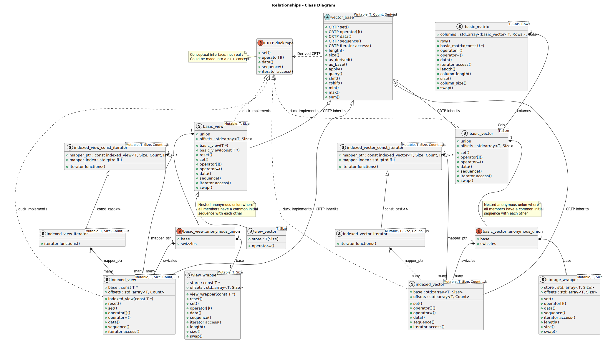

# dsga API

The API is primarily dictated by the OpenGL Shading Language 4.6 specification ([pdf](https://www.khronos.org/registry/OpenGL/specs/gl/GLSLangSpec.4.60.pdf) | [html](https://registry.khronos.org/OpenGL/specs/gl/GLSLangSpec.4.60.html)) for vectors and matrices. It is also dictated by the need to interact with the ```c++20``` ecosystem.

## Contents
* [Library ```cxcm```](#library-cxcm)
* [Namespace ```dsga```](#namespace-dsga)
* [Concepts](#concepts)
* [Variable Templates](#variable-templates)
* [Using Directives](#using-directives)
* [Utility Functions](#utility-functions)
* [Class Templates](#class-templates)
* [Class Template Instantiations](#class-template-instantiations)
* Vector
  * [Vector Operators](#vector-operators)
  * [Vector Free Functions](#vector-free-functions)
  * [Scalar Functions](#scalar-functions)
* Matrix
  * [Matrix Operators](#matrix-operators)
  * [Matrix Free Functions](#matrix-free-functions)
* [Simple Conversion Functions](#simple-conversion-functions)
* [Tuple Protocol](#tuple-protocol)

## Library cxcm
[cxcm](https://github.com/davidbrowne/cxcm) is its own stand-alone project for extending ```<cmath>``` to have more functions be constexpr, targeted for ```c++20```. ```c++23``` and hopefully ```c++26``` extend the amount of functions in ```<cmath>``` to be constexpr, but this project aims to support ```c++20```. ```cxcm``` has been brought in under ```namespace dsga``` as a nested ```namespace cxcm```, with all the functionality of the stand-alone ```cxcm``` release. This allows us to have a single header library for ```dsga```.

```dsga``` needs ```cxcm``` to implement some of the vector free functions as constexpr functions. Some of these functions are designed so that if they are invoked at runtime instead of compile time, then they invoke the corresponding functions in the standard library, giving us the fastest implementation. See the [```cxcm``` API](https://github.com/davidbrowne/cxcm/blob/main/README.md#cxcm-free-functions) for how to use. Remember, ```cxcm``` is a nested namespace under ```namespace dsga``` for this project.

## namespace dsga
Unless otherwise stated, all of the API is defined in ```namespace dsga```.

### Concepts

* [```bool_scalar```](#bool_scalar)
* [```signed_scalar```](#signed_scalar)
* [```unsigned_scalar```](#unsigned_scalar)
* [```numeric_integral_scalar```](#numeric_integral_scalar)
* [```floating_point_scalar```](#floating_point_scalar)
* [```non_bool_scalar```](#non_bool_scalar)
* [```dimensional_scalar```](#dimensional_scalar)
* [```dimensional_size```](#dimensional_size)
* [```dimensional_storage```](#dimensional_storage)
* [```promotes_to```](#promotes_to)
* [```implicitly_convertible_to```](#implicitly_convertible_to)
* [```indexable```](#indexable)

#### ```bool_scalar```
```c++
template <typename T>
concept bool_scalar = std::same_as<bool, T>;
```
Plain undecorated boolean type.

#### ```signed_scalar```
```c++
template <typename T>
concept signed_scalar = (std::same_as<int, T> || std::same_as<long long, T>);
```
Plain undecorated signed types.

#### ```unsigned_scalar```
```c++
template <typename T>
concept unsigned_scalar = (std::same_as<unsigned int, T> || std::same_as<unsigned long long, T> || std::same_as<std::size_t, T>);
```
Plain undecorated unsigned types.

#### ```numeric_integral_scalar```
```c++
template <typename T>
concept numeric_integral_scalar = (signed_scalar<T> || unsigned_scalar<T>);
```
Plain undecorated integral types.

#### ```floating_point_scalar```
```c++
template <typename T>
concept floating_point_scalar = (std::same_as<float, T> || std::same_as<double, T>);
```
Plain undecorated floating point types.

#### ```non_bool_scalar```
```c++
template <typename T>
concept non_bool_scalar = (numeric_integral_scalar<T> || floating_point_scalar<T>);
```
Plain undecorated integral and floating point types.

#### ```dimensional_scalar```
```c++
template <typename T>
concept dimensional_scalar = (non_bool_scalar<T> || bool_scalar<T>);
```
Plain undecorated arithmetic types.

#### ```dimensional_size```
```c++
template <std::size_t Size>
concept dimensional_size = ((Size >= 1u) && (Size <= 4u));
```
We want the size to be between 1 and 4, inclusive.

#### ```dimensional_storage```
```c++
template <typename T, std::size_t Size>
concept dimensional_storage = dimensional_scalar<T> && dimensional_size<Size>;
```
Vector type and size requirements.

#### ```promotes_to```
```c++
template <typename T, typename U>
concept promotes_to =
requires
{
    typename std::common_type_t<std::remove_cvref_t<T>, std::remove_cvref_t<U>>;
    requires std::same_as<std::common_type_t<std::remove_cvref_t<T>, std::remove_cvref_t<U>>, std::remove_cvref_t<U>>;
};
```
Is the second type U also the common type of the two types T and U?

#### ```implicitly_convertible_to```
```c++
template <typename T, typename U>
concept implicitly_convertible_to = non_bool_scalar<T> && non_bool_scalar<U> && promotes_to<T, U>;
```
Are implicit conversions allowed for non-boolean arithmetic purposes?

#### ```indexable```
```c++
template <typename T, std::size_t Size, std::size_t Count, std::size_t ...Is>
concept indexable = dimensional_storage<T, Size> && detail::valid_index_count<Count, Is...> && detail::valid_range_indexes<Size, Is...>;
```
Do the template parameters meet the requirements for a valid ```indexed_vector```?

Size and Count are two different things, with Size being the physical number of elements, and Count being the logical number of elements. Count must be the ```sizeof...Is```, and for every one of the Is, it must be smaller than Size.

### Variable Templates

* [```writable_swizzle```](#writable_swizzle)
* [```degrees_per_radian_v```](#degrees_per_radian_v)
* [```radians_per_degree_v```](#radians_per_degree_v)

#### ```writable_swizzle```
```c++
template <std::size_t Size, std::size_t Count, std::size_t ...Is>
constexpr inline bool writable_swizzle = detail::valid_index_count<Count, Is...> && detail::unique_indexes<Is...> && detail::valid_range_indexes<Size, Is...>;
```
Used for the Writable template parameter of a ```indexed_vector```. Can a particular swizzle be used as an lvalue reference. All of the swizzle indexes must have been used at most once, e.g., for ```xyz```, Writable is true, and for ```xyx```, Writable is false (assuming that all other requirements are met).

#### ```degrees_per_radian_v```
```c++
template <std::floating_point T>
inline constexpr T degrees_per_radian_v = std::numbers::inv_pi_v<T> * T(180);
```

#### ```radians_per_degree_v```
```c++
template <std::floating_point T>
inline constexpr T radians_per_degree_v = std::numbers::pi_v<T> / T(180);
```

### Using Directives

* [```dimensional_storage_t```](#dimensional_storage_t)
* [```make_index_range```](#make_index_range)
* [```make_closed_index_range```](#make_closed_index_range)
* [```make_array_sequence```](#make_array_sequence)
* Using Directives for Creating ```indexed_vector```s
  * [```dexvec1```](#dexvec1)
  * [```dexvec2```](#dexvec2)
  * [```dexvec3```](#dexvec3)
  * [```dexvec4```](#dexvec4)

#### ```dimensional_storage_t```
```c++
template <dimensional_scalar T, std::size_t Size>
requires dimensional_storage<T, Size>
using dimensional_storage_t = std::array<T, Size>;
```
The underlying storage type for ```storage_wrappper``` and ```indexed_vector```. It is contiguous, and it has contiguous iterators.

#### ```make_index_range```
```c++
template<std::size_t Start, std::size_t End>
using make_index_range = decltype(detail::index_range<Start, End>());
```
This gives a half-open/half-closed interval in a ```std::index_sequence``` -> [Start, End). If End is less than Start, the sequence is in descending order.

#### ```make_closed_index_range```
```c++
template<std::size_t Start, std::size_t End>
using make_closed_index_range = decltype(detail::closed_index_range<Start, End>());
```
This gives a closed interval in a ```std::index_sequence``` -> [Start, End]. If End is less than Start, the sequence is in descending order.

#### ```make_array_sequence```
```c++
template <detail::sequence_indexable auto vals>
using make_array_sequence = decltype(detail::indexable_to_sequence<vals>(std::make_index_sequence<vals.size()>{}));
```
This gives a ```std::index_sequence``` that contains the elements of a constexpr ```std::array<T, N> vals```, where ```T``` is convertible to a ```std::size_t``` and none of the elements are negative. Constexpr non-type template parameter```vals``` doesn't have to be of type ```std::array<T, N>```, but it must have constexpr member functions ```size``` and ```operator []```, both of whose return values are convertible to ```std::size_t```, e.g., ```dsga::basic_vector<T, N>```, as long as all values in the vector are non-negative and ```std::convertible_to<T, std::size_t>``` is true.

#### Using Directives for Creating ```indexed_vector```s

#### ```dexvec1```
```c++
template <typename T, std::size_t Size, std::size_t I>
using dexvec1 = indexed_vector<std::remove_cvref_t<T>, Size, 1u, I>;
```
Convenience using directive for creating a ```indexed_vector``` for ```Count == 1```.

#### ```dexvec2```
```c++
template <typename T, std::size_t Size, std::size_t ...Is>
requires (sizeof...(Is) == 2u)
using dexvec2 = indexed_vector<std::remove_cvref_t<T>, Size, 2u, Is...>;
```
Convenience using directive for creating a ```indexed_vector``` for ```Count == 2```.

#### ```dexvec3```
```c++
template <typename T, std::size_t Size, std::size_t ...Is>
requires (sizeof...(Is) == 3u)
using dexvec3 = indexed_vector<std::remove_cvref_t<T>, Size, 3u, Is...>;
```
Convenience using directive for creating a ```indexed_vector``` for ```Count == 3```.

#### ```dexvec4```
```c++
template <typename T, std::size_t Size, std::size_t ...Is>
requires (sizeof...(Is) == 4u)
using dexvec4 = indexed_vector<std::remove_cvref_t<T>, Size, 4u, Is...>;
```
Convenience using directive for creating a ```indexed_vector``` for ```Count == 4```.

### Utility Functions

* [```make_sequence_array```](#make_sequence_array)
* [```make_reverse_sequence```](#make_reverse_sequence)
* [```is_constexpr```](#is_constexpr)

#### ```make_sequence_array```
```c++
template <std::size_t... Is>
constexpr std::array<std::size_t, sizeof...(Is)> make_sequence_array(std::index_sequence<Is...>) noexcept;
```
Build an array from the indexes of a ```std::index_sequence```.

#### ```make_reverse_sequence```
```c++
template<std::size_t ...Is>
constexpr auto make_reverse_sequence(std::index_sequence<Is...> seq) noexcept;
```
Convert a ```std::index_sequence<Is...>``` to another ```std::index_sequence``` with the ```Is...``` in reverse order from input.

#### ```is_constexpr```
```c++
template <typename C, auto val = std::bool_constant<(C{}(), true)>{}>
consteval auto is_constexpr(C);
```
Is a default-constructible callable constexpr? If not, then compile error due to trying to evaluate something that is not constexpr at compile time.

### Class Templates

* [```basic_vector```](#basic_vector)
* [```basic_matrix```](#basic_matrix)
* [```indexed_vector```](#indexed_vector)
  * [```indexed_vector_iterator```](#indexed_vector_iterator)
  * [```indexed_vector_const_iterator```](#indexed_vector_const_iterator)
* [```vector_base```](#vector_base)
* [```storage_wrapper```](#storage_wrapper)

This diagram explores the relationships between the various ```dsga``` template classes, which are actually all structs. The main two template structs are ```basic_vector``` and ```basic_matrix```. The other structs are in support of those two primary components.



#### ```storage_wrapper```
```c++
template <dimensional_scalar T, std::size_t Size>
requires dimensional_storage<T, Size>
struct storage_wrapper;
```
This struct is structurally equivalent to [```indexed_vector```](#indexed_vector). They both wrap a data member of type ```dimensional_storage_t```. When comparing an [```indexed_vector```](#indexed_vector) and ```dimensional_storage_t``` of the same type and size, as members in a union, they satisfy the type trait ```std::is_corresponding_member```. For a union of many members of [```indexed_vector```](#indexed_vector) and a member of ```dimensional_storage_t```, these all share a [common initial sequence](https://en.cppreference.com/w/cpp/language/data_members). This allows us to read any of the union members without having to make a member active first (via writing). An anonymous union of a ```storage_wrapper``` and multiple swizzles of [```indexed_vector```](#indexed_vector) instantiations constitutes the data of a [```basic_vector```](#basic_vector).

```storage_wrapper``` is not part of the GLSL specification, but it is used by [```basic_vector```](#basic_vector) for writing data to storage. It has been designed to have a similar API to [```basic_vector```](#basic_vector).

* Template Parameters
  * ```T``` - type of the ```storage_wrapper``` elements. Must satisfy [```dimensional_scalar```](#dimensional_scalar).
  * ```Size``` - number of ```storage_wrapper``` elements. Must satisfy [```dimensional_size```](#dimensional_size).
* Non-Static Data Members
  * [```store```](#storage_wrapperstore)
* Static Data Members
  * [```Count```](#storage_wrappercount)
  * [```Writable```](#storage_wrapperwritable)
  * [```offsets```](#storage_wrapperoffsets)
  * [```size``` (```std::integral_constant```)](#storage_wrappersize-stdintegral_constant)
* Static Member Functions
  * [```size``` (theoretical function)](#storage_wrappersize-theoretical-function)
* Non-Static Member Functions
  * [```length```](#storage_wrapperlength)
  * [```operator []```](#storage_wrapperoperator-)
  * [```data```](#storage_wrapperdata)
  * [```sequence```](#storage_wrappersequence)
  * [```set```](#storage_wrapperset)
  * [```swap```](#storage_wrapperswap)
  * [Iterators](#storage_wrapper-iterators)
* Using Directives
  * [```sequence_pack```](#storage_wrappersequence_pack)
  * ```value_type```
  * ```iterator```
  * ```const_iterator```
  * ```reverse_iterator```
  * ```const_reverse_iterator```

* [Free Functions](#storage_wrapper-free-functions)
* [Class Template Argument Deduction (CTAD)](#storage_wrapper-ctad)

##### ```storage_wrapper::store```
```c++
dimensional_storage_t<T, Size> store;
```
The data member for the storage.

##### ```storage_wrapper::Count```
```c++
static constexpr std::size_t Count = Size;
```
The static variable that holds the number of items that we are handling. It is always the same value as the template parameter ```Size```. It is unnecessary for this class, but it is used here to be in solidarity with ```indexed_vector```, where ```Size``` and ```Count``` are often not the same value.

##### ```storage_wrapper::Writable```
```c++
static constexpr bool Writable = true;
```
This static variable is always true for all ```storage_wrapper```s. It is unnecessary for this class, but it is used in here to be in solidarity with ```indexed_vector```, where Writable is not always true (mostly false actually).

##### ```storage_wrapper::offsets```
```c++
static constexpr std::array<std::size_t, Count> offsets = make_sequence_array(sequence_pack{});
```
The static ```std::array``` for how the physical representation is mapped to the logical representation. For ```storage_wrapper```, the physical and logical representations are the same, i.e., a contiguous representation, and the sequence ascends from 0.

##### ```storage_wrapper::size``` (```std::integral_constant```)
```c++
static constexpr std::integral_constant<std::size_t, Count> size = {};
```

##### ```storage_wrapper::size``` (theoretical function)
```c++
[[nodiscard]] static constexpr std::size_t size() const noexcept;
```
Return the number of components in the struct. The declaration for ```size()``` is a fiction due to the fact that this function does not exist; however, the static ```std::integral_constant``` ```size``` has an ```operator()()``` that operates exactly as the above declaration. This approach of using a ```std::integral_constant``` for ```size``` is supposed to be an up and coming idiom in the C++ standard for all new standard library components with constant sizes.

##### ```storage_wrapper::length```
```c++
[[nodiscard]] constexpr int length() const noexcept;
```
The GLSL specification requires that the ```length method``` behave as a member function, returning the number of components in the struct.

##### ```storage_wrapper::operator []```
```c++
[[nodiscard]] constexpr T &operator [](std::integral auto index) noexcept requires Writable;
[[nodiscard]] constexpr const T &operator [](std::integral auto index) const noexcept;
```
Data access through the indexing operator. The indexing operator already takes the physical to logical data mapping into account. For ```storage_wrapper```, the elements are contiguous, so the physical and logical mapping is the same.

##### ```storage_wrapper::data```
```c++
[[nodiscard]] constexpr T * data() noexcept requires Writable;
[[nodiscard]] constexpr const T * data() const noexcept;
```
Data access through pointers. Use with ```sequence``` or ```offsets``` for physical to logical mapping.

##### ```storage_wrapper::sequence```
```c++
[[nodiscard]] constexpr auto sequence() const noexcept;
```
The ```std::index_sequence``` for how the physical representation is mapped to the logical representation. For ```storage_wrapper```, the physical and logical representation are the same, i.e., a contiguous representation, and the sequence ascends from 0.

##### ```storage_wrapper::set```
```c++
template <typename ...Args>
requires Writable && (sizeof...(Args) == Count) && (std::convertible_to<Args, T> &&...)
constexpr void set(Args ...args) noexcept;
```
Set all the values of a ```storage_wrapper``` via parameter copies. This prevents aliasing issues with references.

##### ```storage_wrapper::swap```
```c++
constexpr void swap(storage_wrapper &sw) noexcept requires Writable;
```
Swap the data using the underlying ```dimensional_storage_t```'s ```swap``` function.

##### ```storage_wrapper``` Iterators
```c++
[[nodiscard]] constexpr auto begin() noexcept requires Writable;
[[nodiscard]] constexpr auto begin() const noexcept;
[[nodiscard]] constexpr auto cbegin() const noexcept;
[[nodiscard]] constexpr auto end() noexcept requires Writable;
[[nodiscard]] constexpr auto end() const noexcept;
[[nodiscard]] constexpr auto cend() const noexcept;

[[nodiscard]] constexpr auto rbegin() noexcept requires Writable;
[[nodiscard]] constexpr auto rbegin() const noexcept;
[[nodiscard]] constexpr auto crbegin() const noexcept;
[[nodiscard]] constexpr auto rend() noexcept requires Writable;
[[nodiscard]] constexpr auto rend() const noexcept;
[[nodiscard]] constexpr auto crend() const noexcept;
```
These contiguous iterators are supplied by the underlying ```dimensional_storage_t```.

##### ```storage_wrapper::sequence_pack```
```c++
using sequence_pack = std::make_index_sequence<Count>;
```
The instantiation of ```std::index_sequence``` that represents the physical to logical mapping. ```sequence``` returns an instance of this type.

##### ```storage_wrapper``` Free Functions

```c++
template <dimensional_scalar T, std::size_t Size>
constexpr void swap(storage_wrapper<T, Size> &lhs, storage_wrapper<T, Size> &rhs) noexcept;
```
Free function ```swap``` wraps the member function ```storage_wrapper::swap```.

```c++
template <dimensional_scalar T1, std::size_t C, dimensional_scalar T2>
requires implicitly_convertible_to<T2, T1>
constexpr bool operator ==(const storage_wrapper<T1, C> &first,
                           const storage_wrapper<T2, C> &second) noexcept;
```
Returns whether all the components are exactly equal.

```c++
template <dimensional_scalar T1, std::size_t C, dimensional_scalar T2>
requires implicitly_convertible_to<T2, T1>
constexpr bool operator !=(const storage_wrapper<T1, C> &first,
                           const storage_wrapper<T2, C> &second) noexcept;
```
Function automatically generated from ```operator ==```. Returns whether any of the components are not exactly equal.

##### ```storage_wrapper``` CTAD
```c++
template <dimensional_scalar T, dimensional_scalar ...U>
storage_wrapper(T, U...) -> storage_wrapper<T, 1 + sizeof...(U)>;
```
[Class template argument deduction (CTAD)](https://en.cppreference.com/w/cpp/language/class_template_argument_deduction) for ```storage_wrapper```.

#### ```vector_base```
```c++
template <bool Writable, dimensional_scalar T, std::size_t Count, typename Derived>
requires dimensional_storage<T, Count>
struct vector_base;
```
This [CRTP](https://en.wikipedia.org/wiki/Curiously_recurring_template_pattern) base class is inherited by derived classes [```basic_vector```](#basic_vector) and [```indexed_vector```](#indexed_vector). It has no data members of its own. Most all of the vector operators and free functions operate on ```vector_base``` instead of the derived vectors, as we want to treat the two derived vector types as similarly as possible.

* Template Parameters
  * ```Writable``` - certain derived classes are not writable, namely most template instantiations of ```indexed_vector```. If ```Writable``` is false, then ```vector_base``` is effectively const.
  * ```T``` - type of the vector elements. Must satisfy [```dimensional_scalar```](#dimensional_scalar).
  * ```Count``` - number of logical vector elements. Must satisfy [```dimensional_size```](#dimensional_size).
  * ```Derived``` - the type of this derived class for which ```vector_base``` is a CRTP base class.
* Non-Static Data Members
  * None.
* Static Data Members
  * [```size``` (```std::integral_constant```)](#vector_basesize-stdintegral_constant)
* Static Member Functions
  * [```size``` (theoretical function)](#vector_basesize-theoretical-function)
* Non-Static Member Functions
  * [```length```](#vector_baselength)
  * [```as_derived```](#vector_baseas_derived)
  * [```operator []```](#vector_baseoperator-)
  * [```data```](#vector_basedata)
  * [```sequence```](#vector_basesequence)
  * [```set```](#vector_baseset)
  * [Iterators](#vector_base-iterators)
  * [```std::valarray```](https://en.cppreference.com/w/cpp/numeric/valarray) API
    * [```apply```](#vector_baseapply)
    * [```shift```](#vector_baseshift)
    * [```cshift```](#vector_basecshift)
    * [```min```](#vector_basemin)
    * [```max```](#vector_basemax)
    * [```sum```](#vector_basesum)
* [Vector Operators](#vector-operators)
* [Vector Free Functions](#vector-free-functions)

##### ```vector_base::size``` (```std::integral_constant```)
```c++
static constexpr std::integral_constant<std::size_t, Count> size = {};
```

##### ```vector_base::size``` (theoretical function)
```c++
[[nodiscard]] static constexpr std::size_t size() const noexcept;
```
Return the number of components in the derived struct. The declaration for ```size()``` is a fiction due to the fact that this function does not exist; however, the static ```std::integral_constant``` ```size``` has an ```operator()()``` that operates exactly as the above declaration. This approach of using a ```std::integral_constant``` for ```size``` is supposed to be an up and coming idiom in the C++ standard for all new standard library components with constant sizes.

##### ```vector_base::length```
```c++
[[nodiscard]] constexpr int length() const noexcept;
```
The GLSL specification requires that the ```length method``` behave as a member function, returning the number of components in the struct.

##### ```vector_base::as_derived```
```c++
[[nodiscard]] constexpr Derived &as_derived() noexcept requires Writable;

[[nodiscard]] constexpr const Derived &as_derived() const noexcept;
```
Since this is a CRTP base class, one of the template type parameters is for the class/struct that derived from ```vector_base```. This function returns a reference to the derived class/struct version of the ```vector_base```.

##### ```vector_base::operator []```
```c++
[[nodiscard]] constexpr T &operator [](std::integral auto index) noexcept requires Writable;

[[nodiscard]] constexpr const T &operator [](std::integral auto index) const noexcept;
```
Data access through the indexing operator. This CRTP function calls the derived class/struct version of the function.

##### ```vector_base::data```
```c++
[[nodiscard]] constexpr T * data() noexcept requires Writable;

[[nodiscard]] constexpr const T * data() const noexcept;
```
Data access through pointers. Use with ```sequence``` or ```offsets``` for physical to logical mapping. This CRTP function calls the derived class/struct version of the function.

##### ```vector_base::sequence```
```c++
[[nodiscard]] constexpr auto sequence() const noexcept;
```
The ```std::index_sequence``` for how the physical representation is mapped to the logical representation. This CRTP function calls the derived class/struct version of the function.

##### ```vector_base::set```
```c++
template <typename ...Args>
requires Writable && (sizeof...(Args) == Count) && (std::convertible_to<Args, T> &&...)
constexpr void set(Args ...args) noexcept;
```
Set all the values of the derived struct/class via parameter copies. This prevents aliasing issues with references. This CRTP function calls the derived class/struct version of the function.

##### ```vector_base``` Iterators
```c++
[[nodiscard]] constexpr auto begin() noexcept requires Writable;
[[nodiscard]] constexpr auto begin() const noexcept;
[[nodiscard]] constexpr auto cbegin() const noexcept;
[[nodiscard]] constexpr auto end() noexcept requires Writable;
[[nodiscard]] constexpr auto end() const noexcept;
[[nodiscard]] constexpr auto cend() const noexcept;

[[nodiscard]] constexpr auto rbegin() noexcept requires Writable;
[[nodiscard]] constexpr auto rbegin() const noexcept;
[[nodiscard]] constexpr auto crbegin() const noexcept;
[[nodiscard]] constexpr auto rend() noexcept requires Writable;
[[nodiscard]] constexpr auto rend() const noexcept;
[[nodiscard]] constexpr auto crend() const noexcept;
```
These CRTP functions call the derived class/struct versions of the functions.

##### ```vector_base::apply```
```c++
template <typename UnOp>
requires (std::same_as<T, std::invoke_result_t<UnOp, T>> || std::same_as<T, std::invoke_result_t<UnOp, const T &>>)
[[nodiscard]] constexpr basic_vector<T, Count> apply(UnOp op) const noexcept;
```
Applies a lambda/function/function object/callable to every element of a vector. The callable must take either a ```T``` or ```const T &```, and it must return a ```T```. Returns a vector of the results.

##### ```vector_base::shift```
```c++
[[nodiscard]] constexpr basic_vector<T, Count> shift(int by) const noexcept;
```
Zero-filling shift the elements of the vector. Returns a vector of the results.

##### ```vector_base::cshift```
```c++
[[nodiscard]] constexpr basic_vector<T, Count> cshift(int by) const noexcept;
```
Circular shift of the elements of the vector. Returns a vector of the results.

##### ```vector_base::min```
```c++
[[nodiscard]] constexpr T min() const noexcept requires non_bool_scalar<T>;
```
Returns the smallest element.

##### ```vector_base::max```
```c++
[[nodiscard]] constexpr T max() const noexcept requires non_bool_scalar<T>;
```
Returns the largest element.

##### ```vector_base::sum```
```c++
[[nodiscard]] constexpr T sum() const noexcept requires non_bool_scalar<T>;
```
Returns the sum of all elements.

#### ```indexed_vector```
```c++
template <dimensional_scalar T, std::size_t Size, std::size_t Count, std::size_t ...Is>
requires indexable<T, Size, Count, Is...>
struct indexed_vector<T, Size, Count, Is...>
    : vector_base<writable_swizzle<Size, Count, Is...>, T, Count, indexed_vector<T, Size, Count, Is...>>;
```
One of the two vector types that inherit from [```vector_base```](#vector_base). This type represents a [swizzle](https://en.wikipedia.org/wiki/Swizzling_(computer_graphics)) of a [```basic_vector```](#basic_vector). It is a physically non-contiguous, logically contiguous vector. It is not expected to be used except as the swizzle members of the anonymous union in a [```basic_vector```](#basic_vector). A [```basic_vector```](#basic_vector) is easily constructed from or assigned to from an ```indexed_vector```.

Like [```storage_wrapper```](#storage_wrapper), this struct wraps a data member of type ```dimensional_storage_t```.

Since this vector type is physically non-contiguous, the iterator structs are not contiguous. The two iterator structs [```indexed_vector_iterator```](#indexed_vector_iterator) and [```indexed_vector_const_iterator```](#indexed_vector_const_iterator) are [random-access iterators](https://en.cppreference.com/w/cpp/iterator/random_access_iterator).

Size and Count are two different things, with Size being the physical number of elements, and Count being the logical number of elements. Count must be the ```sizeof...(Is)```, and for every one of the ```Is```, the value must be smaller than Size.

* Template Parameters
  * ```T``` - type of the ```indexed_vector``` elements. Must satisfy [```dimensional_scalar```](#dimensional_scalar).
  * ```Size``` - physical number of ```indexed_vector``` elements. Must satisfy [```dimensional_size```](#dimensional_size).
  * ```Count``` - logical number of ```indexed_vector``` elements. Must satisfy [```dimensional_size```](#dimensional_size).
  * ```Is...``` - a parameter pack of the logical indexes for an ```indexed_vector```. Count must be the ```sizeof...(Is)```, and for every one of the ```Is```, the value must be smaller than Size.
* Non-Static Data Members
  * [```base```](#indexed_vectorbase)
* Static Data Members
  * [```Writable```](#indexed_vectorwritable)
  * [```offsets```](#indexed_vectoroffsets)
* Static Member Functions
  * None.
* Non-Static Member Functions
  * [```operator []```](#indexed_vectoroperator-)
  * [```operator =```](#indexed_vectoroperator--assignment)
  * [```data```](#indexed_vectordata)
  * [```sequence```](#indexed_vectorsequence)
  * [```set```](#indexed_vectorset)
  * [Iterators](#indexed_vector-iterators)
* Using Directives
  * [```sequence_pack```](#indexed_vectorsequence_pack)
  * ```value_type```
  * ```iterator```
  * ```const_iterator```
  * ```reverse_iterator```
  * ```const_reverse_iterator```
* [Vector Operators](#vector-operators)
* [Vector Free Functions](#vector-free-functions)

##### ```indexed_vector::base```
```c++
dimensional_storage_t<T, Size> base;
```
The data member for the storage.

##### ```indexed_vector::Writable```
```c++
static constexpr bool Writable = writable_swizzle<Size, Count, Is...>;
```
Is this a writable vector. All of the ```Is...``` must be unique for this vector to be writable. If not writable, then it is effectively const.

##### ```indexed_vector::offsets```
```c++
static constexpr std::array<std::size_t, Count> offsets;
```
The static ```std::array``` for how the physical representation is mapped to the logical representation.

##### ```indexed_vector::operator []```
```c++
[[nodiscard]] constexpr T &operator [](std::integral auto index) noexcept requires Writable;

[[nodiscard]] constexpr const T &operator [](std::integral auto index) const noexcept;
```
Data access through the indexing operator. The indexing operator already takes the physical to logical data mapping into account, so no need to use [```sequence```](#indexed_vectorsequence) or [```offsets```](#indexed_vectoroffsets) with this operator.

##### ```indexed_vector::operator =``` (Assignment)
```c++
template <bool W, dimensional_scalar U, typename D>
requires Writable && implicitly_convertible_to<U, T>
constexpr indexed_vector &operator =(const vector_base<W, U, Count, D> &other) noexcept;
```
The assignment operator. It can be assigned from objects that inherit from ```vector_base```.

##### ```indexed_vector::data```
```c++
[[nodiscard]] constexpr T *data() noexcept requires Writable;

[[nodiscard]] constexpr const T *data() const noexcept;
```
Data access through pointers. Use with [```sequence```](#indexed_vectorsequence) or [```offsets```](#indexed_vectoroffsets) for physical to logical mapping.

##### ```indexed_vector::sequence```
```c++
[[nodiscard]] constexpr auto sequence() const noexcept;
```
The ```std::index_sequence``` for how the physical representation is mapped to the logical representation. This is best used with [```data```](#indexed_vectordata) to manually access the elements for the logical representation.

##### ```indexed_vector::set```
```c++
template <typename ... Args>
requires Writable && (std::convertible_to<Args, T> && ...) && (sizeof...(Args) == Count)
constexpr void set(Args ...args) noexcept;
```
Set all the vector element values via parameter copies. This prevents aliasing issues with references.

##### ```indexed_vector``` Iterators
```c++
[[nodiscard]] constexpr auto begin() noexcept requires Writable;
[[nodiscard]] constexpr auto begin() const noexcept;
[[nodiscard]] constexpr auto cbegin() const noexcept;
[[nodiscard]] constexpr auto end() noexcept requires Writable;
[[nodiscard]] constexpr auto end() const noexcept;
[[nodiscard]] constexpr auto cend() const noexcept;

[[nodiscard]] constexpr auto rbegin() noexcept requires Writable;
[[nodiscard]] constexpr auto rbegin() const noexcept;
[[nodiscard]] constexpr auto crbegin() const noexcept;
[[nodiscard]] constexpr auto rend() noexcept requires Writable;
[[nodiscard]] constexpr auto rend() const noexcept;
[[nodiscard]] constexpr auto crend() const noexcept;
```
[Random-access iterators](https://en.cppreference.com/w/cpp/iterator/random_access_iterator) of types [```indexed_vector_iterator```](#indexed_vector_iterator) and [```indexed_vector_const_iterator```](#indexed_vector_const_iterator).

##### ```indexed_vector::sequence_pack```
```c++
using sequence_pack = std::index_sequence<Is...>;
```
The sequence pack is formed by the variadic ```Is...``` from the template parameter pack.

#### ```indexed_vector_iterator```
```c++
template <dimensional_scalar T, std::size_t Size, std::size_t Count, std::size_t ... Is>
requires indexable<T, Size, Count, Is...>
struct indexed_vector_iterator : indexed_vector_const_iterator<T, Size, Count, Is...>;
```
[Random-access iterator](https://en.cppreference.com/w/cpp/iterator/random_access_iterator) for [```indexed_vector```](#indexed_vector)s. Inspired by ```std::array```'s iterator, even though it is a contiguous iterator. It implements the normal API for a [random-access iterator](https://en.cppreference.com/w/cpp/iterator/random_access_iterator).

#### ```indexed_vector_const_iterator```
```c++
template <dimensional_scalar T, std::size_t Size, std::size_t Count, std::size_t ... Is>
requires indexable<T, Size, Count, Is...>
struct indexed_vector_const_iterator;
```
Const [random-access iterator](https://en.cppreference.com/w/cpp/iterator/random_access_iterator) for [```indexed_vector```](#indexed_vector)s. Inspired by ```std::array```'s iterator, even though it is a contiguous iterator. It implements the normal API for a const [random-access iterator](https://en.cppreference.com/w/cpp/iterator/random_access_iterator).

#### ```basic_vector```
```c++
template <dimensional_scalar T, std::size_t Size>
requires dimensional_storage<T, Size>
struct basic_vector : vector_base<true, T, Size, basic_vector<T, Size>>;
```
This is the primary struct for vectors. One of the two vector types that inherit from [```vector_base```](#vector_base). ```basic_vector```s can be [swizzled](https://en.wikipedia.org/wiki/Swizzling_(computer_graphics)), where a swizzle is one of its anonymous union members of type [```indexed_vector```](#indexed_vector). The anonymous union also has a [```storage_wrapper```](#storage_wrapper) member, and the ```basic_vector``` member functions operate on its instances through this data member. All the anonymous union members share a [common initial sequence](https://en.cppreference.com/w/cpp/language/data_members), which means they can be read by any member, regardless of whether it is the active member.

The different sized versions of ```basic_vector``` are individually partially specialized, with sizes from 1 to 4. Each partial specialization has different data members as part of its anonymous union, due to the fact that the swizzles are different depending on ```Size```.

* Template Parameters
  * ```T``` - type of the ```basic_vector``` elements. Must satisfy [```dimensional_scalar```](#dimensional_scalar).
  * ```Size``` - physical number of ```basic_vector``` elements. Must satisfy [```dimensional_size```](#dimensional_size).
* [```basic_vector``` Constructors](#basic_vector-constructors)
* Non-Static Data Members
  * Anonymous Union
    * [```base```](#basic_vectorbase)
    * [```basic_vector``` Swizzles](#basic_vector-swizzles)
* Static Data Members
  * [```Size```](#basic_vectorsize)
  * [```Count```](#basic_vectorcount)
  * [```Writable```](#basic_vectorwritable)
  * [```offsets```](#basic_vectoroffsets)
* Static Member Functions
  * None.
* Non-Static Member Functions
  * [```operator []```](#basic_vectoroperator-)
  * [```operator =```](#basic_vectoroperator--assignment)
  * [```data```](#basic_vectordata)
  * [```sequence```](#basic_vectorsequence)
  * [```set```](#basic_vectorset)
  * [```swap```](#basic_vectorswap)
  * [Iterators](#basic_vector-iterators)
* Using Directives
  * [```sequence_pack```](#basic_vectorsequence_pack)
  * ```value_type```
  * ```iterator```
  * ```const_iterator```
  * ```reverse_iterator```
  * ```const_reverse_iterator```
* [Vector Operators](#vector-operators)
* [Vector Free Functions](#vector-free-functions)
* [```basic_vector``` Free Functions](#basic_vector-free-functions)
* [Class Template Argument Deduction (CTAD)](#basic_vector-ctad)

##### ```basic_vector``` Constructors
```c++
constexpr basic_vector() noexcept = default;
constexpr basic_vector(const basic_vector &) noexcept = default;
constexpr basic_vector(basic_vector &&) noexcept = default;
```
Default constructors.

```c++
template <typename U>
requires std::convertible_to<U, T>
explicit constexpr basic_vector(U value) noexcept;
```
All elements of the vector initialized to the same value.

```c++
template <typename U1, typename U2, typename U3, typename U4>
requires
    std::convertible_to<U1, T> && std::convertible_to<U2, T> &&
    std::convertible_to<U3, T> && std::convertible_to<U4, T>
explicit constexpr basic_vector(U1 xvalue,
                                U2 yvalue,
                                U3 zvalue,
                                U4 wvalue) noexcept;
```
Each of the elements have a scalar value passed in to initialize them. The above declaration is for a ```basic_vector``` of ```Size == 4```. ```basic_vector```s where ```Size == 3``` and ```Size == 2``` have similar constructors based on the number of their elements.

```c++
template <bool W, dimensional_scalar U, typename D>
requires implicitly_convertible_to<U, T>
explicit(false) constexpr basic_vector(const vector_base<W, U, Count, D> &other) noexcept;
```
Initialize a ```basic_vector``` from any of the vector types that derived from ```vector_base```.

```c++
template <typename U, typename ... Args>
requires (detail::valid_vector_component<U, T>::value) && (detail::valid_vector_component<Args, T>::value && ...) && detail::met_component_count<Count, U, Args...>
explicit constexpr basic_vector(const U &u, const Args & ...args) noexcept;
```
Variadic constructor. Can take a combination of vectors, scalars, and matrixes as arguments to initialize the ```basic_vector```.

##### ```basic_vector::base```
```c++
storage_wrapper<T, Size> base;
```
The anonymous union data member through which ```basic_vector``` accesses the vector elements.

##### ```basic_vector``` Swizzles
```c++
dexvec1<T, Size, 0> x;
...
...
dexvec2<T, Size, 0, 0> xx;
...
...
dexvec3<T, Size, 0, 0, 0> xxx;
...
...
dexvec4<T, Size, 0, 0, 0, 0> xxxx;
...
...
```
The other anonymous union data members are all swizzles of the ```basic_vector```. They are of type ```indexed_vector```.

A swizzle data member is named with 1 to 4 element reference characters, e.g., ```xy```, ```wxwz```. Depending on the value of ```Count```, there are restrictions on the swizzle element access. ```x``` maps to the first element, ```y``` maps to the second element, ```z``` maps to the third element, and ```w``` maps to the fourth element.

* ```Count == 1```

Can use {````x````} for swizzle names.

Examples: ```x```, ```xx```, ```xxx```, ```xxxx```.
* ```Count == 2```

Can use {````x````, ````y````} for swizzle names.

Examples: ```y```, ```yx```, ```xyx```, ```yxxy```.
* ```Count == 3```

Can use {````x````, ````y````, ````z````} for swizzle names.

Examples: ```z```, ```zx```, ```zyx```, ```yzxz```.
* ```Count == 4```

Can use {````x````, ````y````, ````z````, ````w````} for swizzle names.

Examples: ```w```, ```yw```, ```zwx```, ```wyxz```.

##### ```basic_vector::Size```
```c++
static constexpr std::size_t Size;
```
Since we instantiate partial specializations of ```basic_vector```, we manually set this value for each of the partial specializations. The value must satisfy [```dimensional_size```](#dimensional_size). For the partial specializations, there is no template parameter Size available to use within the class/struct, and this static data member simulates such a template parameter.

##### ```basic_vector::Count```
```c++
static constexpr std::size_t Count = Size;
```
The static variable that holds the number of items that we are handling. It is always the same value as the template parameter ```Size```. It is unnecessary for this class, but it is used here to be in solidarity with ```indexed_vector```, where ```Size``` and ```Count``` are often not the same value.

##### ```basic_vector::Writable```
```c++
static constexpr bool Writable = true;
```
This static variable is always true for all ```basic_vector```s. It is unnecessary for this class, but it is used in here to be in solidarity with ```indexed_vector```, where Writable is not always true (mostly false actually).

##### ```basic_vector::offsets```
```c++
static constexpr std::array<std::size_t, Count> offsets = make_sequence_array(sequence_pack{});
```
The static ```std::array``` for how the physical representation is mapped to the logical representation. For ```basic_vector```, the physical and logical representations are the same, i.e., a contiguous representation, and the sequence ascends from 0.

##### ```basic_vector::operator []```
```c++
[[nodiscard]] constexpr T &operator [](std::integral auto index) noexcept requires Writable;

[[nodiscard]] constexpr const T &operator [](std::integral auto index) const noexcept;
```
Data access through the indexing operator. The indexing operator already takes the physical to logical data mapping into account. For ```basic_vector```, the elements are contiguous, so the physical and logical mapping is the same.

##### ```basic_vector::operator =``` (Assignment)
```c++
template <bool W, dimensional_scalar U, typename D>
requires Writable && implicitly_convertible_to<U, T>
constexpr basic_vector &operator =(const vector_base<W, U, Count, D> &other) noexcept;
```
The assignment operator. It can be assigned from objects that inherit from ```vector_base```.

##### ```basic_vector::data```
```c++
[[nodiscard]] constexpr T *data() noexcept requires Writable;

[[nodiscard]] constexpr const T *data() const noexcept;
```
Data access through pointers. Use with ```sequence``` or ```offsets``` for physical to logical mapping. For ```basic_vector```, the elements are contiguous, so the physical and logical mapping is the same.

##### ```basic_vector::sequence```
```c++
[[nodiscard]] constexpr auto sequence() const noexcept;
```
The ```std::index_sequence``` for how the physical representation is mapped to the logical representation. For ```basic_vector```, the physical and logical representation are the same, i.e., a contiguous representation, and the sequence ascends from 0.

##### ```basic_vector::set```
```c++
template <typename ...Args>
requires Writable && (sizeof...(Args) == Count) && (std::convertible_to<Args, T> && ...)
constexpr void set(Args ...args) noexcept;
```
Set all the vector element values via parameter copies. This prevents aliasing issues with references.

##### ```basic_vector::swap```
```c++
constexpr void swap(basic_vector &bv) noexcept requires Writable;
```
Swap the data using the underlying ```dimensional_storage_t```'s ```swap``` function.

##### ```basic_vector``` Iterators
```c++
[[nodiscard]] constexpr auto begin() noexcept requires Writable;
[[nodiscard]] constexpr auto begin() const noexcept;
[[nodiscard]] constexpr auto cbegin() const noexcept;
[[nodiscard]] constexpr auto end() noexcept requires Writable;
[[nodiscard]] constexpr auto end() const noexcept;
[[nodiscard]] constexpr auto cend() const noexcept;

[[nodiscard]] constexpr auto rbegin() noexcept requires Writable;
[[nodiscard]] constexpr auto rbegin() const noexcept;
[[nodiscard]] constexpr auto crbegin() const noexcept;
[[nodiscard]] constexpr auto rend() noexcept requires Writable;
[[nodiscard]] constexpr auto rend() const noexcept;
[[nodiscard]] constexpr auto crend() const noexcept;
```
These contiguous iterators are supplied indirectly by the underlying ```dimensional_storage_t```. Each data member of the anonymous union, whether a ```storage_wrapper``` or an ```indexed_vector```, has a single data member of type ```dimensional_storage_t```. The iterators are accessed through ```base```.

##### ```basic_vector::sequence_pack```
```c++
using sequence_pack = std::make_index_sequence<Count>;
```
The instantiation of ```std::index_sequence``` that represents the physical to logical mapping. ```sequence``` returns an instance of this type.

##### ```basic_vector``` Free Functions
```c++
template <dimensional_scalar T, std::size_t Size>
constexpr void swap(basic_vector<T, Size> &lhs, basic_vector<T, Size> &rhs) noexcept;
```
Free function ```swap``` wraps the member function ```basic_vector::swap```.

##### ```basic_vector``` CTAD
```c++
template <dimensional_scalar T, dimensional_scalar ...U>
basic_vector(T, U...) -> basic_vector<T, 1 + sizeof...(U)>;

template <bool W, dimensional_scalar T, std::size_t C, typename D>
basic_vector(const vector_base<W, T, C, D> &) -> basic_vector<T, C>;
```
[Class template argument deduction (CTAD)](https://en.cppreference.com/w/cpp/language/class_template_argument_deduction) for ```basic_vector```.

#### ```basic_matrix```
```c++
template <floating_point_scalar T, std::size_t C, std::size_t R>
requires (((C >= 2u) && (C <= 4u)) && ((R >= 2u) && (R <= 4u)))
struct basic_matrix;
```
The struct that represents a matrix. The matrix elements are stored column order, as an array of column [```basic_vector```](#basic_vector)s. The terminology looks backwards, with number of columns coming before the number of rows, but it makes sense from a data storage perspective. It is also how GLSL does it.

* Template Parameters
  * ```T``` - type of the ```basic_matrix``` elements. Must satisfy [```floating_point_scalar```](#floating_point_scalar).
  * ```C``` - number of columns, ```where 2 <= C <= 4```.
  * ```R``` - number of rows, ```where 2 <= R <= 4```.
* [```basic_matrix``` Constructors](#basic_matrix-constructors)
* Non-Static Data Members
  * [```columns```](#basic_matrixcolumns)
* Static Data Members
  * [```ComponentCount```](#basic_matrixcomponentcount)
  * [```size``` (```std::integral_constant```)](#basic_matrixsize-stdintegral_constant)
  * [```column_size``` (```std::integral_constant```)](#basic_matrixcolumn_size-stdintegral_constant)
* Static Member Functions
  * [```size``` (theoretical function)](#basic_matrixsize-theoretical-function)
  * [```column_size``` (theoretical function)](#basic_matrixcolumn_size-theoretical-function)
* Non-Static Member Functions
  * [```length```](#basic_matrixlength)
  * [```column_length```](#basic_matrixcolumn_length)
  * [```operator []```](#basic_matrixoperator-)
  * [```operator =```](#basic_matrixoperator--assignment)
  * [```data```](#basic_matrixdata)
  * [```row```](#basic_matrixrow)
  * [```swap```](#basic_matrixswap)
  * [Iterators](#basic_matrix-iterators)
* [Matrix Operators](#matrix-operators)
* [Matrix Free Functions](#matrix-free-functions)
* [```basic_matrix``` Free Functions](#basic_matrix-free-functions)

##### ```basic_matrix``` Constructors
```c++
constexpr basic_matrix() noexcept = default;
constexpr basic_matrix(const basic_matrix &) noexcept = default;
constexpr basic_matrix(basic_matrix &&) noexcept = default;
```
Default constructors.

```c++
template <typename U, typename ... Args>
requires (detail::valid_matrix_component<U, T>::value) && (detail::valid_matrix_component<Args, T>::value && ...) && detail::met_component_count<ComponentCount, U, Args...>
explicit constexpr basic_matrix(const U &u, const Args & ...args) noexcept;
```
Variadic constructor. Can take a combination of vectors and scalars as arguments to initialize the ```basic_matrix```.

```c++
template <typename U>
requires std::convertible_to<U, T> && (C == R)
explicit constexpr basic_matrix(U arg) noexcept;
```
Diagonal constructor for square matrices.

```c++
template <floating_point_scalar U>
requires implicitly_convertible_to<U, T>
explicit(false) constexpr basic_matrix(const basic_matrix<U, C, R> &arg) noexcept;

template <floating_point_scalar U, std::size_t Cols, std::size_t Rows>
requires implicitly_convertible_to<U, T> && (Cols != C || Rows != R)
explicit(false) constexpr basic_matrix(const basic_matrix<U, Cols, Rows> &arg) noexcept;

template <floating_point_scalar U, std::size_t Cols, std::size_t Rows>
requires (!implicitly_convertible_to<U, T> && std::convertible_to<U, T>)
explicit constexpr basic_matrix(const basic_matrix<U, Cols, Rows> &arg) noexcept;
```
Constructors that take a matrix as an argument, but not a normal copy constructor (see default constructors).

##### ```basic_matrix::columns```
```c++
std::array<basic_vector<T, R>, C> columns;
```
The matrix elements' storage.

##### ```basic_matrix::ComponentCount```
```c++
static constexpr std::size_t ComponentCount = C * R;
```
The number of matrix elements.

##### ```basic_matrix::size``` (```std::integral_constant```)
```c++
static constexpr std::integral_constant<std::size_t, C> size = {};
```
Holds the number of columns, which is the row size.

##### ```basic_matrix::column_size``` (```std::integral_constant```)
```c++
static constexpr std::integral_constant<std::size_t, R> column_size = {};
```
Holds the number of rows, which is the column size.

##### ```basic_matrix::size``` (theoretical function)
```c++
[[nodiscard]] static constexpr std::size_t size() const noexcept;
```
Return the number of columns, which is the row size. The declaration for ```size()``` is a fiction due to the fact that this function does not exist; however, the static ```std::integral_constant``` ```size``` has an ```operator()()``` that operates exactly as the above declaration. This approach of using a ```std::integral_constant``` for ```size``` is supposed to be an up and coming idiom in the C++ standard for all new standard library components with constant sizes.

##### ```basic_matrix::column_size``` (theoretical function)
```c++
[[nodiscard]] constexpr std::size_t column_size() const noexcept;
```
Return the number of rows, which is the column size. The declaration for ```column_size()``` is a fiction due to the fact that this function does not exist; however, the static ```std::integral_constant``` ```column_size``` has an ```operator()()``` that operates exactly as the above declaration. This approach of using a ```std::integral_constant``` for ```size``` (and here also ```column_size```) is supposed to be an up and coming idiom in the C++ standard for all new standard library components with constant sizes.

##### ```basic_matrix::length```
```c++
[[nodiscard]] constexpr int length() const noexcept;
```
Return the number of columns. This is also the row length.

The GLSL specification requires that the ```length method``` behave as a member function.

##### ```basic_matrix::column_length```
```c++
[[nodiscard]] constexpr int column_length() const noexcept;
```
Return the number of rows.

##### ```basic_matrix::operator []```
```c++
[[nodiscard]] constexpr basic_vector<T, R> &operator [](std::integral auto index) noexcept;

[[nodiscard]] constexpr const basic_vector<T, R> &operator [](std::integral auto index) const noexcept;
```
Data access through the indexing operator.

##### ```basic_matrix::operator =``` (Assignment)
```c++
template <floating_point_scalar U>
requires implicitly_convertible_to<U, T>
constexpr basic_matrix &operator =(const basic_matrix<U, C, R> &other) noexcept;
```
The assignment operator.

##### ```basic_matrix::data```
```c++
[[nodiscard]] constexpr basic_vector<T, R> * data() noexcept;

[[nodiscard]] constexpr const basic_vector<T, R> * data() const noexcept;
```
Data access through pointers.

##### ```basic_matrix::row```
```c++
[[nodiscard]] constexpr basic_vector<T, C> row(std::integral auto row_index) const noexcept;
```
Return a row from the column-order matrix.

##### ```basic_matrix::swap```
```c++
constexpr void swap(basic_matrix &bm) noexcept;
```
Swap the data using the underlying ```std::array```'s ```swap``` function.

##### ```basic_matrix``` Iterators
```c++
[[nodiscard]] constexpr auto begin() noexcept;
[[nodiscard]] constexpr auto begin() const noexcept;
[[nodiscard]] constexpr auto cbegin() const noexcept;
[[nodiscard]] constexpr auto end() noexcept;
[[nodiscard]] constexpr auto end() const noexcept;
[[nodiscard]] constexpr auto cend() const noexcept;

[[nodiscard]] constexpr auto rbegin() noexcept;
[[nodiscard]] constexpr auto rbegin() const noexcept;
[[nodiscard]] constexpr auto crbegin() const noexcept;
[[nodiscard]] constexpr auto rend() noexcept;
[[nodiscard]] constexpr auto rend() const noexcept;
[[nodiscard]] constexpr auto crend() const noexcept;
```
These contiguous ```std::array``` iterators are accessed through ```columns```.

##### ```basic_matrix``` Free Functions
```c++
template <floating_point_scalar T, std::size_t C, std::size_t R>
constexpr void swap(basic_matrix<T, C, R> &lhs, basic_matrix<T, C, R> &rhs) noexcept;
```
Free function ```swap``` wraps the member function ```basic_matrix::swap```.

### Class Template Instantiations
These instantiations represent the classes (structs) that are provided by GLSL, with a few others not in GLSL.

```c++
// boolean vectors
using bscal = basic_vector<bool, 1u>;
using bvec2 = basic_vector<bool, 2u>;
using bvec3 = basic_vector<bool, 3u>;
using bvec4 = basic_vector<bool, 4u>;

// int vectors
using iscal = basic_vector<int, 1u>;
using ivec2 = basic_vector<int, 2u>;
using ivec3 = basic_vector<int, 3u>;
using ivec4 = basic_vector<int, 4u>;

// unsigned int vectors
using uscal = basic_vector<unsigned, 1u>;
using uvec2 = basic_vector<unsigned, 2u>;
using uvec3 = basic_vector<unsigned, 3u>;
using uvec4 = basic_vector<unsigned, 4u>;

// long long vectors (not in GLSL)
using llscal = basic_vector<long long, 1u>;
using llvec2 = basic_vector<long long, 2u>;
using llvec3 = basic_vector<long long, 3u>;
using llvec4 = basic_vector<long long, 4u>;

// unsigned long long vectors (not in GLSL)
using ullscal = basic_vector<unsigned long long, 1u>;
using ullvec2 = basic_vector<unsigned long long, 2u>;
using ullvec3 = basic_vector<unsigned long long, 3u>;
using ullvec4 = basic_vector<unsigned long long, 4u>;

// float vectors with out an 'f' prefix -- this is from GLSL
using scal = basic_vector<float, 1u>;
using vec2 = basic_vector<float, 2u>;
using vec3 = basic_vector<float, 3u>;
using vec4 = basic_vector<float, 4u>;

// also float vectors, but using the common naming convention (not in GLSL)
using fscal = basic_vector<float, 1u>;
using fvec2 = basic_vector<float, 2u>;
using fvec3 = basic_vector<float, 3u>;
using fvec4 = basic_vector<float, 4u>;

// double vectors
using dscal = basic_vector<double, 1u>;
using dvec2 = basic_vector<double, 2u>;
using dvec3 = basic_vector<double, 3u>;
using dvec4 = basic_vector<double, 4u>;

// float matrices
using mat2x2 = basic_matrix<float, 2u, 2u>;
using mat2x3 = basic_matrix<float, 2u, 3u>;
using mat2x4 = basic_matrix<float, 2u, 4u>;
using mat3x2 = basic_matrix<float, 3u, 2u>;
using mat3x3 = basic_matrix<float, 3u, 3u>;
using mat3x4 = basic_matrix<float, 3u, 4u>;
using mat4x2 = basic_matrix<float, 4u, 2u>;
using mat4x3 = basic_matrix<float, 4u, 3u>;
using mat4x4 = basic_matrix<float, 4u, 4u>;

using mat2 = basic_matrix<float, 2u, 2u>;
using mat3 = basic_matrix<float, 3u, 3u>;
using mat4 = basic_matrix<float, 4u, 4u>;

// double matrices
using dmat2x2 = basic_matrix<double, 2u, 2u>;
using dmat2x3 = basic_matrix<double, 2u, 3u>;
using dmat2x4 = basic_matrix<double, 2u, 4u>;
using dmat3x2 = basic_matrix<double, 3u, 2u>;
using dmat3x3 = basic_matrix<double, 3u, 3u>;
using dmat3x4 = basic_matrix<double, 3u, 4u>;
using dmat4x2 = basic_matrix<double, 4u, 2u>;
using dmat4x3 = basic_matrix<double, 4u, 3u>;
using dmat4x4 = basic_matrix<double, 4u, 4u>;

using dmat2 = basic_matrix<double, 2u, 2u>;
using dmat3 = basic_matrix<double, 3u, 3u>;
using dmat4 = basic_matrix<double, 4u, 4u>;
```

### Vector Operators

* Vector Unary Operators
  * [```operator +```](#vector-unary-plus)
  * [```operator -```](#vector-unary-minus)
  * [```operator ++```](#vector-unary-increment)
  * [```operator --```](#vector-unary-decrement)
  * [```operator ~```](#vector-unary-bit-wise-ones-complement)
* Vector Binary Operators
  * [```operator +```](#vector-binary-plus)
  * [```operator -```](#vector-binary-minus)
  * [```operator *```](#vector-binary-times)
  * [```operator /```](#vector-binary-division)
  * [```operator %```](#vector-binary-modulus)
  * [```operator >>```](#vector-binary-right-shift)
  * [```operator <<```](#vector-binary-left-shift)
  * [```operator &```](#vector-binary-bitwise-and)
  * [```operator |```](#vector-binary-bitwise-or)
  * [```operator ^```](#vector-binary-bitwise-xor)
* Vector Compound Assignment Operators
  * [```operator +=```](#vector-plus-assignment)
  * [```operator -=```](#vector-minus-assignment)
  * [```operator *=```](#vector-times-assignment)
  * [```operator /=```](#vector-division-assignment)
  * [```operator %=```](#vector-modulus-assignment)
  * [```operator >>=```](#vector-right-shift-assignment)
  * [```operator <<=```](#vector-left-shift-assignment)
  * [```operator &=```](#vector-bitwise-and-assignment)
  * [```operator |=```](#vector-bitwise-or-assignment)
  * [```operator ^=```](#vector-bitwise-xor-assignment)
* Vector Comparison Operators
  * [```operator ==```](#vector-equals)
  * [```operator !=```](#vector-not-equals)

#### Vector Unary Operators

##### Vector Unary Plus
```c++
template <bool W, non_bool_scalar T, std::size_t C, typename D>
[[nodiscard]] constexpr auto operator +(const vector_base<W, T, C, D> &arg) noexcept;
```

##### Vector Unary Minus
```c++
template <bool W, non_bool_scalar T, std::size_t C, typename D>
[[nodiscard]] constexpr auto operator -(const vector_base<W, T, C, D> &arg) noexcept;
```

##### Vector Unary Increment
```c++
template <bool W, non_bool_scalar T, std::size_t C, typename D>
requires W
constexpr auto &operator ++(vector_base<W, T, C, D> &arg) noexcept;

template <bool W, non_bool_scalar T, std::size_t C, typename D>
requires W
constexpr auto operator ++(vector_base<W, T, C, D> &arg, int) noexcept;
```

##### Vector Unary Decrement
```c++
template <bool W, non_bool_scalar T, std::size_t C, typename D>
requires W
constexpr auto &operator --(vector_base<W, T, C, D> &arg) noexcept;

template <bool W, non_bool_scalar T, std::size_t C, typename D>
requires W
constexpr auto operator --(vector_base<W, T, C, D> &arg, int) noexcept;
```

##### Vector Unary Bit-wise One's Complement
```c++
template <bool W, numeric_integral_scalar T, std::size_t C, typename D>
[[nodiscard]] constexpr auto operator ~(const vector_base<W, T, C, D> &arg) noexcept;
```

#### Vector Binary Operators

##### Vector Binary Plus
```c++
template <bool W1, non_bool_scalar T1, std::size_t C1, typename D1, bool W2, non_bool_scalar T2, std::size_t C2, typename D2>
requires (implicitly_convertible_to<T2, T1> || implicitly_convertible_to<T1, T2>) && (C1 == C2 || C1 == 1u || C2 == 1u)
[[nodiscard]] constexpr auto operator +(const vector_base<W1, T1, C1, D1> &lhs,
                                        const vector_base<W2, T2, C2, D2> &rhs) noexcept;

template <bool W, non_bool_scalar T, std::size_t C, typename D, non_bool_scalar U>
requires implicitly_convertible_to<U, T> || implicitly_convertible_to<T, U>
[[nodiscard]] constexpr auto operator +(const vector_base<W, T, C, D> &lhs,
                                        U rhs) noexcept;

template <bool W, non_bool_scalar T, std::size_t C, typename D, non_bool_scalar U>
requires implicitly_convertible_to<U, T> || implicitly_convertible_to<T, U>
[[nodiscard]] constexpr auto operator +(U lhs,
                                        const vector_base<W, T, C, D> &rhs) noexcept;
```

##### Vector Binary Minus
```c++
template <bool W1, non_bool_scalar T1, std::size_t C1, typename D1, bool W2, non_bool_scalar T2, std::size_t C2, typename D2>
requires (implicitly_convertible_to<T2, T1> || implicitly_convertible_to<T1, T2>) && (C1 == C2 || C1 == 1u || C2 == 1u)
[[nodiscard]] constexpr auto operator -(const vector_base<W1, T1, C1, D1> &lhs,
                                        const vector_base<W2, T2, C2, D2> &rhs) noexcept;

template <bool W, non_bool_scalar T, std::size_t C, typename D, non_bool_scalar U>
requires implicitly_convertible_to<U, T> || implicitly_convertible_to<T, U>
[[nodiscard]] constexpr auto operator -(const vector_base<W, T, C, D> &lhs,
                                        U rhs) noexcept;

template <bool W, non_bool_scalar T, std::size_t C, typename D, non_bool_scalar U>
requires implicitly_convertible_to<U, T> || implicitly_convertible_to<T, U>
[[nodiscard]] constexpr auto operator -(U lhs,
                                        const vector_base<W, T, C, D> &rhs) noexcept;
```

##### Vector Binary Times
```c++
template <bool W1, non_bool_scalar T1, std::size_t C1, typename D1, bool W2, non_bool_scalar T2, std::size_t C2, typename D2>
requires (implicitly_convertible_to<T2, T1> || implicitly_convertible_to<T1, T2>) && (C1 == C2 || C1 == 1u || C2 == 1u)
[[nodiscard]] constexpr auto operator *(const vector_base<W1, T1, C1, D1> &lhs,
                                        const vector_base<W2, T2, C2, D2> &rhs) noexcept;

template <bool W, non_bool_scalar T, std::size_t C, typename D, non_bool_scalar U>
requires implicitly_convertible_to<U, T> || implicitly_convertible_to<T, U>
[[nodiscard]] constexpr auto operator *(const vector_base<W, T, C, D> &lhs,
                                        U rhs) noexcept;

template <bool W, non_bool_scalar T, std::size_t C, typename D, non_bool_scalar U>
requires implicitly_convertible_to<U, T> || implicitly_convertible_to<T, U>
[[nodiscard]] constexpr auto operator *(U lhs,
                                        const vector_base<W, T, C, D> &rhs) noexcept;
```

##### Vector Binary Division
```c++
template <bool W1, non_bool_scalar T1, std::size_t C1, typename D1, bool W2, non_bool_scalar T2, std::size_t C2, typename D2>
requires (implicitly_convertible_to<T2, T1> || implicitly_convertible_to<T1, T2>) && (C1 == C2 || C1 == 1u || C2 == 1u)
[[nodiscard]] constexpr auto operator /(const vector_base<W1, T1, C1, D1> &lhs,
                                        const vector_base<W2, T2, C2, D2> &rhs) noexcept;

template <bool W, non_bool_scalar T, std::size_t C, typename D, non_bool_scalar U>
requires implicitly_convertible_to<U, T> || implicitly_convertible_to<T, U>
[[nodiscard]] constexpr auto operator /(const vector_base<W, T, C, D> &lhs,
                                        U rhs) noexcept;

template <bool W, non_bool_scalar T, std::size_t C, typename D, non_bool_scalar U>
requires implicitly_convertible_to<U, T> || implicitly_convertible_to<T, U>
[[nodiscard]] constexpr auto operator /(U lhs,
                                        const vector_base<W, T, C, D> &rhs) noexcept;
```

##### Vector Binary Modulus
```c++
template <bool W1, numeric_integral_scalar T1, std::size_t C1, typename D1, bool W2, numeric_integral_scalar T2, std::size_t C2, typename D2>
requires (implicitly_convertible_to<T2, T1> || implicitly_convertible_to<T1, T2>) && (C1 == C2 || C1 == 1u || C2 == 1u)
[[nodiscard]] constexpr auto operator %(const vector_base<W1, T1, C1, D1> &lhs,
                                        const vector_base<W2, T2, C2, D2> &rhs) noexcept;

template <bool W, numeric_integral_scalar T, std::size_t C, typename D, numeric_integral_scalar U>
requires implicitly_convertible_to<U, T> || implicitly_convertible_to<T, U>
[[nodiscard]] constexpr auto operator %(const vector_base<W, T, C, D> &lhs,
                                        U rhs) noexcept;

template <bool W, numeric_integral_scalar T, std::size_t C, typename D, numeric_integral_scalar U>
requires implicitly_convertible_to<U, T> || implicitly_convertible_to<T, U>
[[nodiscard]] constexpr auto operator %(U lhs,
                                        const vector_base<W, T, C, D> &rhs) noexcept;
```

##### Vector Binary Right Shift
```c++
template <bool W1, numeric_integral_scalar T1, std::size_t C1, typename D1, bool W2, numeric_integral_scalar T2, std::size_t C2, typename D2>
requires (implicitly_convertible_to<T2, T1> || implicitly_convertible_to<T1, T2>) && (C1 == C2 || C1 == 1u || C2 == 1u)
[[nodiscard]] constexpr auto operator >>(const vector_base<W1, T1, C1, D1> &lhs,
                                         const vector_base<W2, T2, C2, D2> &rhs) noexcept;

template <bool W, numeric_integral_scalar T, std::size_t C, typename D, numeric_integral_scalar U>
requires implicitly_convertible_to<U, T> || implicitly_convertible_to<T, U>
[[nodiscard]] constexpr auto operator >>(const vector_base<W, T, C, D> &lhs,
                                         U rhs) noexcept;

template <bool W, numeric_integral_scalar T, std::size_t C, typename D, numeric_integral_scalar U>
requires implicitly_convertible_to<U, T> || implicitly_convertible_to<T, U>
[[nodiscard]] constexpr auto operator >>(U lhs,
                                         const vector_base<W, T, C, D> &rhs) noexcept;
```

##### Vector Binary Left Shift
```c++
template <bool W1, numeric_integral_scalar T1, std::size_t C1, typename D1, bool W2, numeric_integral_scalar T2, std::size_t C2, typename D2>
requires (implicitly_convertible_to<T2, T1> || implicitly_convertible_to<T1, T2>) && (C1 == C2 || C1 == 1u || C2 == 1u)
[[nodiscard]] constexpr auto operator <<(const vector_base<W1, T1, C1, D1> &lhs,
                                         const vector_base<W2, T2, C2, D2> &rhs) noexcept;

template <bool W, numeric_integral_scalar T, std::size_t C, typename D, numeric_integral_scalar U>
requires implicitly_convertible_to<U, T> || implicitly_convertible_to<T, U>
[[nodiscard]] constexpr auto operator <<(const vector_base<W, T, C, D> &lhs,
                                         U rhs) noexcept;

template <bool W, numeric_integral_scalar T, std::size_t C, typename D, numeric_integral_scalar U>
requires implicitly_convertible_to<U, T> || implicitly_convertible_to<T, U>
[[nodiscard]] constexpr auto operator <<(U lhs,
                                         const vector_base<W, T, C, D> &rhs) noexcept;
```

##### Vector Binary Bitwise And
```c++
template <bool W1, numeric_integral_scalar T1, std::size_t C1, typename D1, bool W2, numeric_integral_scalar T2, std::size_t C2, typename D2>
requires (implicitly_convertible_to<T2, T1> || implicitly_convertible_to<T1, T2>) && (C1 == C2 || C1 == 1u || C2 == 1u) && detail::same_sizeof<T1, T2>
[[nodiscard]] constexpr auto operator &(const vector_base<W1, T1, C1, D1> &lhs,
                                        const vector_base<W2, T2, C2, D2> &rhs) noexcept;

template <bool W, numeric_integral_scalar T, std::size_t C, typename D, numeric_integral_scalar U>
requires (implicitly_convertible_to<U, T> || implicitly_convertible_to<T, U>) && detail::same_sizeof<T, U>
[[nodiscard]] constexpr auto operator &(const vector_base<W, T, C, D> &lhs,
                                        U rhs) noexcept;

template <bool W, numeric_integral_scalar T, std::size_t C, typename D, numeric_integral_scalar U>
requires (implicitly_convertible_to<U, T> || implicitly_convertible_to<T, U>) && detail::same_sizeof<T, U>
[[nodiscard]] constexpr auto operator &(U lhs,
                                        const vector_base<W, T, C, D> &rhs) noexcept;
```

##### Vector Binary Bitwise Or
```c++
template <bool W1, numeric_integral_scalar T1, std::size_t C1, typename D1, bool W2, numeric_integral_scalar T2, std::size_t C2, typename D2>
requires (implicitly_convertible_to<T2, T1> || implicitly_convertible_to<T1, T2>) && (C1 == C2 || C1 == 1u || C2 == 1u) && detail::same_sizeof<T1, T2>
[[nodiscard]] constexpr auto operator |(const vector_base<W1, T1, C1, D1> &lhs,
                                        const vector_base<W2, T2, C2, D2> &rhs) noexcept;

template <bool W, numeric_integral_scalar T, std::size_t C, typename D, numeric_integral_scalar U>
requires (implicitly_convertible_to<U, T> || implicitly_convertible_to<T, U>) && detail::same_sizeof<T, U>
[[nodiscard]] constexpr auto operator |(const vector_base<W, T, C, D> &lhs,
                                        U rhs) noexcept;

template <bool W, numeric_integral_scalar T, std::size_t C, typename D, numeric_integral_scalar U>
requires (implicitly_convertible_to<U, T> || implicitly_convertible_to<T, U>) && detail::same_sizeof<T, U>
[[nodiscard]] constexpr auto operator |(U lhs,
                                        const vector_base<W, T, C, D> &rhs) noexcept;
```

##### Vector Binary Bitwise Xor
```c++
template <bool W1, numeric_integral_scalar T1, std::size_t C1, typename D1, bool W2, numeric_integral_scalar T2, std::size_t C2, typename D2>
requires (implicitly_convertible_to<T2, T1> || implicitly_convertible_to<T1, T2>) && (C1 == C2 || C1 == 1u || C2 == 1u) && detail::same_sizeof<T1, T2>
[[nodiscard]] constexpr auto operator ^(const vector_base<W1, T1, C1, D1> &lhs,
                                        const vector_base<W2, T2, C2, D2> &rhs) noexcept;

template <bool W, numeric_integral_scalar T, std::size_t C, typename D, numeric_integral_scalar U>
requires (implicitly_convertible_to<U, T> || implicitly_convertible_to<T, U>) && detail::same_sizeof<T, U>
[[nodiscard]] constexpr auto operator ^(const vector_base<W, T, C, D> &lhs,
                                        U rhs) noexcept;

template <bool W, numeric_integral_scalar T, std::size_t C, typename D, numeric_integral_scalar U>
requires (implicitly_convertible_to<U, T> || implicitly_convertible_to<T, U>) && detail::same_sizeof<T, U>
[[nodiscard]] constexpr auto operator ^(U lhs,
                                        const vector_base<W, T, C, D> &rhs) noexcept;
```

#### Vector Compound Assignment Operators

##### Vector Plus Assignment
```c++
template <bool W1, non_bool_scalar T1, std::size_t C, typename D1, bool W2, non_bool_scalar T2, typename D2>
requires W1 && implicitly_convertible_to<T2, T1>
constexpr auto &operator +=(vector_base<W1, T1, C, D1> &lhs,
                            const vector_base<W2, T2, C, D2> &rhs) noexcept;

template <bool W1, non_bool_scalar T1, std::size_t C, typename D1, bool W2, non_bool_scalar T2, typename D2>
requires W1 && implicitly_convertible_to<T2, T1> && (C > 1)
constexpr auto &operator +=(vector_base<W1, T1, C, D1> &lhs,
                            const vector_base<W2, T2, 1u, D2> &rhs) noexcept;

template <bool W, non_bool_scalar T, std::size_t C, typename D, non_bool_scalar U>
requires W && implicitly_convertible_to<U, T>
constexpr auto &operator +=(vector_base<W, T, C, D> &lhs,
                            U rhs) noexcept;
```

##### Vector Minus Assignment
```c++
template <bool W1, non_bool_scalar T1, std::size_t C, typename D1, bool W2, non_bool_scalar T2, typename D2>
requires W1 && implicitly_convertible_to<T2, T1>
constexpr auto &operator -=(vector_base<W1, T1, C, D1> &lhs,
                            const vector_base<W2, T2, C, D2> &rhs) noexcept;

template <bool W1, non_bool_scalar T1, std::size_t C, typename D1, bool W2, non_bool_scalar T2, typename D2>
requires W1 && implicitly_convertible_to<T2, T1> && (C > 1)
constexpr auto &operator -=(vector_base<W1, T1, C, D1> &lhs,
                            const vector_base<W2, T2, 1u, D2> &rhs) noexcept;

template <bool W, non_bool_scalar T, std::size_t C, typename D, non_bool_scalar U>
requires W && implicitly_convertible_to<U, T>
constexpr auto &operator -=(vector_base<W, T, C, D> &lhs,
                            U rhs) noexcept;
```

##### Vector Times Assignment
```c++
template <bool W1, non_bool_scalar T1, std::size_t C, typename D1, bool W2, non_bool_scalar T2, typename D2>
requires W1 && implicitly_convertible_to<T2, T1>
constexpr auto &operator *=(vector_base<W1, T1, C, D1> &lhs,
                            const vector_base<W2, T2, C, D2> &rhs) noexcept;

template <bool W1, non_bool_scalar T1, std::size_t C, typename D1, bool W2, non_bool_scalar T2, typename D2>
requires W1 && implicitly_convertible_to<T2, T1> && (C > 1)
constexpr auto &operator *=(vector_base<W1, T1, C, D1> &lhs,
                            const vector_base<W2, T2, 1u, D2> &rhs) noexcept;

template <bool W, non_bool_scalar T, std::size_t C, typename D, non_bool_scalar U>
requires W && implicitly_convertible_to<U, T>
constexpr auto &operator *=(vector_base<W, T, C, D> &lhs,
                            U rhs) noexcept;
```

##### Vector Division Assignment
```c++
template <bool W1, non_bool_scalar T1, std::size_t C, typename D1, bool W2, non_bool_scalar T2, typename D2>
requires W1 && implicitly_convertible_to<T2, T1>
constexpr auto &operator /=(vector_base<W1, T1, C, D1> &lhs,
                            const vector_base<W2, T2, C, D2> &rhs) noexcept;

template <bool W1, non_bool_scalar T1, std::size_t C, typename D1, bool W2, non_bool_scalar T2, typename D2>
requires W1 && implicitly_convertible_to<T2, T1> && (C > 1)
constexpr auto &operator /=(vector_base<W1, T1, C, D1> &lhs,
                            const vector_base<W2, T2, 1u, D2> &rhs) noexcept;

template <bool W, non_bool_scalar T, std::size_t C, typename D, non_bool_scalar U>
requires W && implicitly_convertible_to<U, T>
constexpr auto &operator /=(vector_base<W, T, C, D> &lhs,
                            U rhs) noexcept;
```

##### Vector Modulus Assignment
```c++
template <bool W1, numeric_integral_scalar T1, std::size_t C, typename D1, bool W2, numeric_integral_scalar T2, typename D2>
requires W1 && implicitly_convertible_to<T2, T1>
constexpr auto &operator %=(vector_base<W1, T1, C, D1> &lhs,
                            const vector_base<W2, T2, C, D2> &rhs) noexcept;

template <bool W1, numeric_integral_scalar T1, std::size_t C, typename D1, bool W2, numeric_integral_scalar T2, typename D2>
requires W1 && implicitly_convertible_to<T2, T1> && (C > 1)
constexpr auto &operator %=(vector_base<W1, T1, C, D1> &lhs,
                            const vector_base<W2, T2, 1u, D2> &rhs) noexcept;

template <bool W, numeric_integral_scalar T, std::size_t C, typename D, numeric_integral_scalar U>
requires W && implicitly_convertible_to<U, T>
constexpr auto &operator %=(vector_base<W, T, C, D> &lhs,
                            U rhs) noexcept;
```

##### Vector Right Shift Assignment
```c++
template <bool W1, numeric_integral_scalar T1, std::size_t C, typename D1, bool W2, numeric_integral_scalar T2, typename D2>
requires W1 && implicitly_convertible_to<T2, T1>
constexpr auto &operator >>=(vector_base<W1, T1, C, D1> &lhs,
                             const vector_base<W2, T2, C, D2> &rhs) noexcept;

template <bool W1, numeric_integral_scalar T1, std::size_t C, typename D1, bool W2, numeric_integral_scalar T2, typename D2>
requires W1 && implicitly_convertible_to<T2, T1> && (C > 1)
constexpr auto &operator >>=(vector_base<W1, T1, C, D1> &lhs,
                             const vector_base<W2, T2, 1u, D2> &rhs) noexcept;

template <bool W, numeric_integral_scalar T, std::size_t C, typename D, numeric_integral_scalar U>
requires W && implicitly_convertible_to<U, T>
constexpr auto &operator >>=(vector_base<W, T, C, D> &lhs,
                             U rhs) noexcept;
```

##### Vector Left Shift Assignment
```c++
template <bool W1, numeric_integral_scalar T1, std::size_t C, typename D1, bool W2, numeric_integral_scalar T2, typename D2>
requires W1 && implicitly_convertible_to<T2, T1>
constexpr auto &operator <<=(vector_base<W1, T1, C, D1> &lhs,
                             const vector_base<W2, T2, C, D2> &rhs) noexcept;

template <bool W1, numeric_integral_scalar T1, std::size_t C, typename D1, bool W2, numeric_integral_scalar T2, typename D2>
requires W1 && implicitly_convertible_to<T2, T1> && (C > 1)
constexpr auto &operator <<=(vector_base<W1, T1, C, D1> &lhs,
                             const vector_base<W2, T2, 1u, D2> &rhs) noexcept;

template <bool W, numeric_integral_scalar T, std::size_t C, typename D, numeric_integral_scalar U>
requires W && implicitly_convertible_to<U, T>
constexpr auto &operator <<=(vector_base<W, T, C, D> &lhs,
                             U rhs) noexcept;
```

##### Vector Bitwise And Assignment
```c++
template <bool W1, numeric_integral_scalar T1, std::size_t C, typename D1, bool W2, numeric_integral_scalar T2, typename D2>
requires W1 && implicitly_convertible_to<T2, T1> && detail::same_sizeof<T1, T2>
constexpr auto &operator &=(vector_base<W1, T1, C, D1> &lhs,
                            const vector_base<W2, T2, C, D2> &rhs) noexcept;

template <bool W1, numeric_integral_scalar T1, std::size_t C, typename D1, bool W2, numeric_integral_scalar T2, typename D2>
requires W1 && implicitly_convertible_to<T2, T1> && (C > 1) && detail::same_sizeof<T1, T2>
constexpr auto &operator &=(vector_base<W1, T1, C, D1> &lhs,
                            const vector_base<W2, T2, 1u, D2> &rhs) noexcept;

template <bool W, numeric_integral_scalar T, std::size_t C, typename D, numeric_integral_scalar U>
requires W && implicitly_convertible_to<U, T> && detail::same_sizeof<T, U>
constexpr auto &operator &=(vector_base<W, T, C, D> &lhs,
                            U rhs) noexcept;
```

##### Vector Bitwise Or Assignment
```c++
template <bool W1, numeric_integral_scalar T1, std::size_t C, typename D1, bool W2, numeric_integral_scalar T2, typename D2>
requires W1 && implicitly_convertible_to<T2, T1> && detail::same_sizeof<T1, T2>
constexpr auto &operator |=(vector_base<W1, T1, C, D1> &lhs,
                            const vector_base<W2, T2, C, D2> &rhs) noexcept;

template <bool W1, numeric_integral_scalar T1, std::size_t C, typename D1, bool W2, numeric_integral_scalar T2, typename D2>
requires W1 && implicitly_convertible_to<T2, T1> && (C > 1) && detail::same_sizeof<T1, T2>
constexpr auto &operator |=(vector_base<W1, T1, C, D1> &lhs,
                            const vector_base<W2, T2, 1u, D2> &rhs) noexcept;

template <bool W, numeric_integral_scalar T, std::size_t C, typename D, numeric_integral_scalar U>
requires W && implicitly_convertible_to<U, T> && detail::same_sizeof<T, U>
constexpr auto &operator |=(vector_base<W, T, C, D> &lhs,
                            U rhs) noexcept;
```

##### Vector Bitwise Xor Assignment
```c++
template <bool W1, numeric_integral_scalar T1, std::size_t C, typename D1, bool W2, numeric_integral_scalar T2, typename D2>
requires W1 && implicitly_convertible_to<T2, T1> && detail::same_sizeof<T1, T2>
constexpr auto &operator ^=(vector_base<W1, T1, C, D1> &lhs,
                            const vector_base<W2, T2, C, D2> &rhs) noexcept;

template <bool W1, numeric_integral_scalar T1, std::size_t C, typename D1, bool W2, numeric_integral_scalar T2, typename D2>
requires W1 && implicitly_convertible_to<T2, T1> && (C > 1) && detail::same_sizeof<T1, T2>
constexpr auto &operator ^=(vector_base<W1, T1, C, D1> &lhs,
                            const vector_base<W2, T2, 1u, D2> &rhs) noexcept;

template <bool W, numeric_integral_scalar T, std::size_t C, typename D, numeric_integral_scalar U>
requires W && implicitly_convertible_to<U, T> && detail::same_sizeof<T, U>
constexpr auto &operator ^=(vector_base<W, T, C, D> &lhs,
                            U rhs) noexcept;
```

#### Vector Comparison Operators

##### Vector Equals
```c++
template <bool W1, dimensional_scalar T1, std::size_t C, typename D1, bool W2, dimensional_scalar T2, typename D2>
requires implicitly_convertible_to<T2, T1>
constexpr bool operator ==(const vector_base<W1, T1, C, D1> &first,
                           const vector_base<W2, T2, C, D2> &second) noexcept;

template <bool W1, dimensional_scalar T, std::size_t C, typename D1, bool W2, typename D2>
constexpr bool operator ==(const vector_base<W1, T, C, D1> &first,
                           const vector_base<W2, T, C, D2> &second) noexcept;
```
If a signature of ```operator ==``` is not matched, ```c++20``` will swap the argument order to see if there is a match.

##### Vector Not Equals
```c++20``` automatically creates ```operator !=``` from [```operator ==```](#vector-equals).

### Vector Free Functions
We have two different vector types, ```basic_vector``` and ```indexed_vector```. We want the vector functions take work for both types, so most of the vector functions take instances of the vector types' common base class, ```vector_base```.

Most of the functions perform their operation component-wise. There are some functions that treat the vector geometrically and treat the components as part of a whole.

* Angle and Trigonometry Functions
  * [```radians```](#radians)
  * [```degrees```](#degrees)
  * [```sin```](#sin)
  * [```cos```](#cos)
  * [```tan```](#tan)
  * [```asin```](#asin)
  * [```acos```](#acos)
  * [```atan```](#atan)
  * [```sinh```](#sinh)
  * [```cosh```](#cosh)
  * [```tanh```](#tanh)
  * [```asinh```](#asinh)
  * [```acosh```](#acosh)
  * [```atanh```](#atanh)
* Exponential Functions
  * [```pow```](#pow)
  * [```exp```](#exp)
  * [```log```](#log)
  * [```exp2```](#exp2)
  * [```log2```](#log2)
  * [```sqrt```](#sqrt)
  * [```inversesqrt```](#inversesqrt)
  * [```fast_inversesqrt```](#fast_inversesqrt)
* Common Functions
  * [```abs```](#abs)
  * [```sign```](#sign)
  * [```floor```](#floor)
  * [```trunc```](#trunc)
  * [```round```](#round)
  * [```roundEven```](#roundeven)
  * [```ceil```](#ceil)
  * [```fract```](#fract)
  * [```mod```](#mod)
  * [```modf```](#modf)
  * [```min```](#min)
  * [```max```](#max)
  * [```clamp```](#clamp)
  * [```mix```](#mix)
  * [```step```](#step)
  * [```smoothstep```](#smoothstep)
  * [```isnan```](#isnan)
  * [```isinf```](#isinf)
  * [```floatBitsToInt```](#floatbitstoint)
  * [```floatBitsToUint```](#floatbitstouint)
  * [```doubleBitsToLongLong```](#doublebitstolonglong)
  * [```doubleBitsToUlongLong```](#doublebitstoulonglong)
  * [```intBitsToFloat```](#intbitstofloat)
  * [```uintBitsToFloat```](#uintbitstofloat)
  * [```longLongBitsToDouble```](#longlongbitstodouble)
  * [```ulongLongBitsToDouble```](#ulonglongbitstodouble)
  * [```fma```](#fma)
  * [```frexp```](#frexp)
  * [```ldexp```](#ldexp)
  * [```byteswap```](#byteswap)
* Geometric Functions
  * [```length```](#length)
  * [```distance```](#distance)
  * [```innerProduct```](#innerproduct)
  * [```dot```](#dot)
  * [```cross```](#cross)
  * [```normalize```](#normalize)
  * [```faceforward```](#faceforward)
  * [```reflect```](#reflect)
  * [```refract```](#refract)
* Vector Relational Functions
  * [```lessThan```](#lessthan)
  * [```lessThanEqual```](#lessthanequal)
  * [```greaterThan```](#greaterthan)
  * [```greaterThanEqual```](#greaterthanequal)
  * [```equal```](#equal)
  * [```notEqual```](#notequal)
  * [```any```](#any)
  * [```all```](#all)
  * [```none```](#none)
  * [```logicalNot```](#logicalnot)
* Tolerance Checking Functions
  * [```within_distance```](#within_distance)
  * [```within_box```](#within_box)
* Other Vector Functions
  * [```swizzle```](#swizzle)

#### Angle and Trigonometry Functions

##### ```radians```
```c++
template <bool W, floating_point_scalar T, std::size_t C, typename D>
[[nodiscard]] constexpr auto radians(const vector_base<W, T, C, D> &deg) noexcept;
```

##### ```degrees```
```c++
template <bool W, floating_point_scalar T, std::size_t C, typename D>
[[nodiscard]] constexpr auto degrees(const vector_base<W, T, C, D> &rad) noexcept;
```

##### ```sin```
```c++
template <bool W, floating_point_scalar T, std::size_t C, typename D>
[[nodiscard]] inline auto sin(const vector_base<W, T, C, D> &arg) noexcept;
```

##### ```cos```
```c++
template <bool W, floating_point_scalar T, std::size_t C, typename D>
[[nodiscard]] inline auto cos(const vector_base<W, T, C, D> &arg) noexcept;
```

##### ```tan```
```c++
template <bool W, floating_point_scalar T, std::size_t C, typename D>
[[nodiscard]] inline auto tan(const vector_base<W, T, C, D> &arg) noexcept;
```

##### ```asin```
```c++
template <bool W, floating_point_scalar T, std::size_t C, typename D>
[[nodiscard]] inline auto asin(const vector_base<W, T, C, D> &arg) noexcept;
```

##### ```acos```
```c++
template <bool W, floating_point_scalar T, std::size_t C, typename D>
[[nodiscard]] inline auto acos(const vector_base<W, T, C, D> &arg) noexcept;
```

##### ```atan```
```c++
template <bool W, floating_point_scalar T, std::size_t C, typename D>
[[nodiscard]] inline auto atan(const vector_base<W, T, C, D> &arg) noexcept;

template <bool W1, floating_point_scalar T, std::size_t C, typename D1, bool W2, typename D2>
[[nodiscard]] inline auto atan(const vector_base<W1, T, C, D1> &y,
                               const vector_base<W2, T, C, D2> &x) noexcept;
```

##### ```sinh```
```c++
template <bool W, floating_point_scalar T, std::size_t C, typename D>
[[nodiscard]] inline auto sinh(const vector_base<W, T, C, D> &arg) noexcept;
```

##### ```cosh```
```c++
template <bool W, floating_point_scalar T, std::size_t C, typename D>
[[nodiscard]] inline auto cosh(const vector_base<W, T, C, D> &arg) noexcept;
```

##### ```tanh```
```c++
template <bool W, floating_point_scalar T, std::size_t C, typename D>
[[nodiscard]] inline auto tanh(const vector_base<W, T, C, D> &arg) noexcept;
```

##### ```asinh```
```c++
template <bool W, floating_point_scalar T, std::size_t C, typename D>
[[nodiscard]] inline auto asinh(const vector_base<W, T, C, D> &arg) noexcept;
```

##### ```acosh```
```c++
template <bool W, floating_point_scalar T, std::size_t C, typename D>
[[nodiscard]] inline auto acosh(const vector_base<W, T, C, D> &arg) noexcept;
```

##### ```atanh```
```c++
template <bool W, floating_point_scalar T, std::size_t C, typename D>
[[nodiscard]] inline auto atanh(const vector_base<W, T, C, D> &arg) noexcept;
```

#### Exponential Functions

##### ```pow```
```c++
template <bool W1, floating_point_scalar T, std::size_t C, typename D1, bool W2, typename D2>
[[nodiscard]] inline auto pow(const vector_base<W1, T, C, D1> &base,
                              const vector_base<W2, T, C, D2> &exp) noexcept;
```

##### ```exp```
```c++
template <bool W, floating_point_scalar T, std::size_t C, typename D>
[[nodiscard]] inline auto exp(const vector_base<W, T, C, D> &arg) noexcept;
```

##### ```log```
```c++
template <bool W, floating_point_scalar T, std::size_t C, typename D>
[[nodiscard]] inline auto log(const vector_base<W, T, C, D> &arg) noexcept;
```

##### ```exp2```
```c++
template <bool W, floating_point_scalar T, std::size_t C, typename D>
[[nodiscard]] inline auto exp2(const vector_base<W, T, C, D> &arg) noexcept;
```

##### ```log2```
```c++
template <bool W, floating_point_scalar T, std::size_t C, typename D>
[[nodiscard]] inline auto log2(const vector_base<W, T, C, D> &arg) noexcept;
```

##### ```sqrt```
```c++
template <bool W, floating_point_scalar T, std::size_t C, typename D>
[[nodiscard]] constexpr auto sqrt(const vector_base<W, T, C, D> &arg) noexcept;
```

##### ```inversesqrt```
```c++
template <bool W, floating_point_scalar T, std::size_t C, typename D>
[[nodiscard]] constexpr auto inversesqrt(const vector_base<W, T, C, D> &arg) noexcept;
```

##### ```fast_inversesqrt```
```c++
template <bool W, floating_point_scalar T, std::size_t C, typename D>
[[nodiscard]] constexpr auto fast_inversesqrt(const vector_base<W, T, C, D> &arg) noexcept;
```
Not in GLSL. May or may not actually be faster that ```rsqrt()```, for which this function is an approximation for. For ```float```, this function is 100% in agreement with ```rsqrt()```. For ```double```, the relationship to ```rsqrt()``` is:
  * 0 ulps: ~68.58%
  * 1 ulps: ~31.00%
  * 2 ulps:  ~0.42%

#### Common Functions

##### ```abs```
```c++
template <bool W, dimensional_scalar T, std::size_t C, typename D>
requires (!unsigned_scalar<T>) && non_bool_scalar<T>
[[nodiscard]] constexpr auto abs(const vector_base<W, T, C, D> &arg) noexcept;
```

##### ```sign```
```c++
template <bool W, dimensional_scalar T, std::size_t C, typename D>
requires (!unsigned_scalar<T>) && non_bool_scalar<T>
[[nodiscard]] constexpr auto sign(const vector_base<W, T, C, D> &arg) noexcept;
```

##### ```floor```
```c++
template <bool W, floating_point_scalar T, std::size_t C, typename D>
[[nodiscard]] constexpr auto floor(const vector_base<W, T, C, D> &arg) noexcept;
```

##### ```trunc```
```c++
template <bool W, floating_point_scalar T, std::size_t C, typename D>
[[nodiscard]] constexpr auto trunc(const vector_base<W, T, C, D> &arg) noexcept;
```

##### ```round```
```c++
template <bool W, floating_point_scalar T, std::size_t C, typename D>
[[nodiscard]] constexpr auto round(const vector_base<W, T, C, D> &arg) noexcept;
```

##### ```roundEven```
```c++
template <bool W, floating_point_scalar T, std::size_t C, typename D>
[[nodiscard]] constexpr auto roundEven(const vector_base<W, T, C, D> &arg) noexcept;
```

##### ```ceil```
```c++
template <bool W, floating_point_scalar T, std::size_t C, typename D>
[[nodiscard]] constexpr auto ceil(const vector_base<W, T, C, D> &arg) noexcept;
```

##### ```fract```
```c++
template <bool W, floating_point_scalar T, std::size_t C, typename D>
[[nodiscard]] constexpr auto fract(const vector_base<W, T, C, D> &arg) noexcept;
```

##### ```mod```
```c++
template <bool W1, floating_point_scalar T, std::size_t C, typename D1, bool W2, typename D2>
[[nodiscard]] constexpr auto mod(const vector_base<W1, T, C, D1> &x,
                                 const vector_base<W2, T, C, D2> &y) noexcept;

template <bool W, floating_point_scalar T, std::size_t C, typename D>
[[nodiscard]] constexpr auto mod(const vector_base<W, T, C, D> &x,
                                 T y) noexcept;
```

##### ```modf```
```c++
template <bool W1, floating_point_scalar T, std::size_t C, typename D1, bool W2, typename D2>
requires W2
[[nodiscard]] constexpr auto modf(const vector_base<W1, T, C, D1> &arg,
                                  vector_base<W2, T, C, D2> &i) noexcept;
```

##### ```min```
```c++
template <bool W1, non_bool_scalar T, std::size_t C, typename D1, bool W2, typename D2>
[[nodiscard]] constexpr auto min(const vector_base<W1, T, C, D1> &x,
                                 const vector_base<W2, T, C, D2> &y) noexcept;

template <bool W, non_bool_scalar T, std::size_t C, typename D>
[[nodiscard]] constexpr auto min(const vector_base<W, T, C, D> &x,
                                 T y) noexcept;
```

##### ```max```
```c++
template <bool W1, non_bool_scalar T, std::size_t C, typename D1, bool W2, typename D2>
[[nodiscard]] constexpr auto max(const vector_base<W1, T, C, D1> &x,
                                 const vector_base<W2, T, C, D2> &y) noexcept;

template <bool W, non_bool_scalar T, std::size_t C, typename D>
[[nodiscard]] constexpr auto max(const vector_base<W, T, C, D> &x,
                                 T y) noexcept;
```

##### ```clamp```
```c++
template <bool W1, non_bool_scalar T, std::size_t C, typename D1, bool W2, typename D2, bool W3, typename D3>
[[nodiscard]] constexpr auto clamp(const vector_base<W1, T, C, D1> &x,
                                   const vector_base<W2, T, C, D2> &min_val,
                                   const vector_base<W3, T, C, D3> &max_val) noexcept;

template <bool W, non_bool_scalar T, std::size_t C, typename D>
[[nodiscard]] constexpr auto clamp(const vector_base<W, T, C, D> &x,
                                   T min_val,
                                   T max_val) noexcept;
```

##### ```mix```
```c++
template <bool W1, floating_point_scalar T, std::size_t C, typename D1, bool W2, typename D2, bool W3, typename D3>
[[nodiscard]] constexpr auto mix(const vector_base<W1, T, C, D1> &x,
                                 const vector_base<W2, T, C, D2> &y,
                                 const vector_base<W3, T, C, D3> &a) noexcept;

template <bool W1, floating_point_scalar T, std::size_t C, typename D1, bool W2, typename D2>
[[nodiscard]] constexpr auto mix(const vector_base<W1, T, C, D1> &x,
                                 const vector_base<W2, T, C, D2> &y,
                                 T a) noexcept;

template <bool W1, dimensional_scalar T, std::size_t C, typename D1, bool W2, typename D2, bool W3, bool_scalar B, typename D3>
[[nodiscard]] constexpr auto mix(const vector_base<W1, T, C, D1> &x,
                                 const vector_base<W2, T, C, D2> &y,
                                 const vector_base<W3, B, C, D3> &a) noexcept;
```

##### ```step```
```c++
template <bool W1, floating_point_scalar T, std::size_t C, typename D1, bool W2, typename D2>
[[nodiscard]] constexpr auto step(const vector_base<W1, T, C, D1> &edge,
                                  const vector_base<W2, T, C, D2> &x) noexcept;

template <bool W, floating_point_scalar T, std::size_t C, typename D>
[[nodiscard]] constexpr auto step(T edge,
                                  const vector_base<W, T, C, D> &x) noexcept;
```

##### ```smoothstep```
```c++
template <bool W1, floating_point_scalar T, std::size_t C, typename D1, bool W2, typename D2, bool W3, typename D3>
[[nodiscard]] constexpr auto smoothstep(const vector_base<W1, T, C, D1> &edge0,
                                        const vector_base<W2, T, C, D2> &edge1,
                                        const vector_base<W3, T, C, D3> &x) noexcept;

template <bool W, floating_point_scalar T, std::size_t C, typename D>
[[nodiscard]] constexpr auto smoothstep(T edge0,
                                        T edge1,
                                        const vector_base<W, T, C, D> &x) noexcept;
```

##### ```isnan```
```c++
template <floating_point_scalar T, std::size_t C>
[[nodiscard]] constexpr auto isnan(const basic_vector<T, C> &arg) noexcept;

template <floating_point_scalar T, std::size_t S, std::size_t C, std::size_t ...Is>
[[nodiscard]] constexpr auto isnan(const indexed_vector<T, S, C, Is...> &arg) noexcept;
```
These functions can not use ```vector_base``` as the parameter type. They must be specialized for the actual types, not the base type. This is due to the C++ Standard Library implementation, at least for MSVC.

##### ```isinf```
```c++
template <floating_point_scalar T, std::size_t C>
[[nodiscard]] constexpr auto isinf(const basic_vector<T, C> &arg) noexcept;

template <floating_point_scalar T, std::size_t S, std::size_t C, std::size_t ...Is>
[[nodiscard]] constexpr auto isinf(const indexed_vector<T, S, C, Is...> &arg) noexcept;
```
These functions can not use ```vector_base``` as the parameter type. They must be specialized for the actual types, not the base type. This is due to the C++ Standard Library implementation, at least for MSVC.

##### ```floatBitsToInt```
```c++
template <bool W, std::size_t C, typename D>
[[nodiscard]] constexpr auto floatBitsToInt(const vector_base<W, float, C, D> &arg) noexcept;
```

##### ```floatBitsToUint```
```c++
template <bool W, std::size_t C, typename D>
[[nodiscard]] constexpr auto floatBitsToUint(const vector_base<W, float, C, D> &arg) noexcept;
```

##### ```doubleBitsToLongLong```
```c++
template <bool W, std::size_t C, typename D>
[[nodiscard]] constexpr auto doubleBitsToLongLong(const vector_base<W, double, C, D> &arg) noexcept;
```
Not in GLSL.

##### ```doubleBitsToUlongLong```
```c++
template <bool W, std::size_t C, typename D>
[[nodiscard]] constexpr auto doubleBitsToUlongLong(const vector_base<W, double, C, D> &arg) noexcept;
```
Not in GLSL.

##### ```intBitsToFloat```
```c++
template <bool W, std::size_t C, typename D>
[[nodiscard]] constexpr auto intBitsToFloat(const vector_base<W, int, C, D> &arg) noexcept;
```

##### ```uintBitsToFloat```
```c++
template <bool W, std::size_t C, typename D>
[[nodiscard]] constexpr auto uintBitsToFloat(const vector_base<W, unsigned int, C, D> &arg) noexcept;
```

##### ```longLongBitsToDouble```
```c++
template <bool W, std::size_t C, typename D>
[[nodiscard]] constexpr auto longLongBitsToDouble(const vector_base<W, long long, C, D> &arg) noexcept;
```
Not in GLSL.

##### ```ulongLongBitsToDouble```
```c++
template <bool W, std::size_t C, typename D>
[[nodiscard]] constexpr auto ulongLongBitsToDouble(const vector_base<W, unsigned long long, C, D> &arg) noexcept;
```
Not in GLSL.

##### ```fma```
```c++
template <bool W1, floating_point_scalar T, std::size_t C, typename D1, bool W2, typename D2, bool W3, typename D3>
[[nodiscard]] inline auto fma(const vector_base<W1, T, C, D1> &a,
                              const vector_base<W2, T, C, D2> &b,
                              const vector_base<W3, T, C, D3> &c) noexcept;
```

##### ```frexp```
```c++
template <bool W1, floating_point_scalar T, std::size_t C, typename D1, bool W2, typename D2>
requires W2
[[nodiscard]] inline auto frexp(const vector_base<W1, T, C, D1> &x,
                                vector_base<W2, int, C, D2> &exp) noexcept;
```

##### ```ldexp```
```c++
template <bool W1, floating_point_scalar T, std::size_t C, typename D1, bool W2, typename D2>
[[nodiscard]] inline auto ldexp(const vector_base<W1, T, C, D1> &x,
                                const vector_base<W2, int, C, D2> &exp) noexcept;
```

##### ```byteswap```
```c++
template <bool W, non_bool_scalar T, std::size_t C, typename D>
[[nodiscard]] inline auto byteswap(const vector_base<W, T, C, D> &x) noexcept;
```
Not in GLSL. This functionality was added to ```c++23```, but since this is a ```c++20``` library, we have to provide the underlying implementation ourselves.

#### Geometric Functions

##### ```length```
```c++
template <bool W, floating_point_scalar T, std::size_t C, typename D>
[[nodiscard]] constexpr auto length(const vector_base<W, T, C, D> &x) noexcept;
```

##### ```distance```
```c++
template <bool W1, floating_point_scalar T1, std::size_t C, typename D1, bool W2, floating_point_scalar T2, typename D2>
[[nodiscard]] constexpr auto distance(const vector_base<W1, T1, C, D1> &p0,
                                      const vector_base<W2, T2, C, D2> &p1) noexcept;
```

##### ```innerProduct```
```c++
template <bool W1, non_bool_scalar T1, std::size_t C, typename D1, bool W2, non_bool_scalar T2, typename D2>
[[nodiscard]] constexpr auto innerProduct(const vector_base<W1, T1, C, D1> &x,
                                          const vector_base<W2, T2, C, D2> &y) noexcept;
```
Not in GLSL. This is just like ```dot```, except without the floating-point restriction.

##### ```dot```
```c++
template <bool W1, floating_point_scalar T1, std::size_t C, typename D1, bool W2, floating_point_scalar T2, typename D2>
[[nodiscard]] constexpr auto dot(const vector_base<W1, T1, C, D1> &x,
                                 const vector_base<W2, T2, C, D2> &y) noexcept;
```

##### ```cross```
```c++
template <bool W1, floating_point_scalar T1, typename D1, bool W2, floating_point_scalar T2, typename D2>
[[nodiscard]] constexpr auto cross(const vector_base<W1, T1, 3u, D1> &x,
                                   const vector_base<W2, T2, 3u, D2> &y) noexcept;
```

##### ```normalize```
```c++
template <bool W, floating_point_scalar T, std::size_t C, typename D>
[[nodiscard]] constexpr auto normalize(const vector_base<W, T, C, D> &x) noexcept;
```

##### ```faceforward```
```c++
template <bool W1, floating_point_scalar T, std::size_t C, typename D1, bool W2, typename D2, bool W3, typename D3>
[[nodiscard]] constexpr auto faceforward(const vector_base<W1, T, C, D1> &n,
                                         const vector_base<W2, T, C, D2> &i,
                                         const vector_base<W3, T, C, D3> &nref) noexcept;
```

##### ```reflect```
```c++
template <bool W1, floating_point_scalar T, std::size_t C, typename D1, bool W2, typename D2>
[[nodiscard]] constexpr auto reflect(const vector_base<W1, T, C, D1> &i,
                                     const vector_base<W2, T, C, D2> &n) noexcept;
```

##### ```refract```
```c++
template <bool W1, floating_point_scalar T, std::size_t C, typename D1, bool W2, typename D2>
[[nodiscard]] constexpr auto refract(const vector_base<W1, T, C, D1> &i,
                                     const vector_base<W2, T, C, D2> &n,
                                     T eta) noexcept;
```

#### Vector Relational Functions

##### ```lessThan```
```c++
template <bool W1, dimensional_scalar T, std::size_t C, typename D1, bool W2, typename D2>
requires non_bool_scalar<T>
[[nodiscard]] constexpr auto lessThan(const vector_base<W1, T, C, D1> &x,
                                      const vector_base<W2, T, C, D2> &y) noexcept;
```

##### ```lessThanEqual```
```c++
template <bool W1, dimensional_scalar T, std::size_t C, typename D1, bool W2, typename D2>
requires non_bool_scalar<T>
[[nodiscard]] constexpr auto lessThanEqual(const vector_base<W1, T, C, D1> &x,
                                           const vector_base<W2, T, C, D2> &y) noexcept;
```

##### ```greaterThan```
```c++
template <bool W1, dimensional_scalar T, std::size_t C, typename D1, bool W2, typename D2>
requires non_bool_scalar<T>
[[nodiscard]] constexpr auto greaterThan(const vector_base<W1, T, C, D1> &x,
                                         const vector_base<W2, T, C, D2> &y) noexcept;
```

##### ```greaterThanEqual```
```c++
template <bool W1, dimensional_scalar T, std::size_t C, typename D1, bool W2, typename D2>
requires non_bool_scalar<T>
[[nodiscard]] constexpr auto greaterThanEqual(const vector_base<W1, T, C, D1> &x,
                                              const vector_base<W2, T, C, D2> &y) noexcept;
```

##### ```equal```
```c++
template <bool W1, dimensional_scalar T, std::size_t C, typename D1, bool W2, typename D2>
requires non_bool_scalar<T>
[[nodiscard]] constexpr auto equal(const vector_base<W1, T, C, D1> &x,
                                   const vector_base<W2, T, C, D2> &y) noexcept;
```

##### ```notEqual```
```c++
template <bool W1, dimensional_scalar T, std::size_t C, typename D1, bool W2, typename D2>
requires non_bool_scalar<T>
[[nodiscard]] constexpr auto notEqual(const vector_base<W1, T, C, D1> &x,
                                      const vector_base<W2, T, C, D2> &y) noexcept;
```

##### ```any```
```c++
template <bool W, std::size_t C, typename D>
[[nodiscard]] constexpr bool any(const vector_base<W, bool, C, D> &x) noexcept;
```
Not a component-wise operation. Relies on all values.

##### ```all```
```c++
template <bool W, std::size_t C, typename D>
[[nodiscard]] constexpr bool all(const vector_base<W, bool, C, D> &x) noexcept;
```
Not a component-wise operation. Relies on all values.

##### ```none```
```c++
template <bool W, std::size_t C, typename D>
[[nodiscard]] constexpr bool none(const vector_base<W, bool, C, D> &x) noexcept;
```
Not in GLSL. Same effect as ```!any(vec)```.

Not a component-wise operation. Relies on all values.

##### ```logicalNot```
```c++
template <bool W, std::size_t C, typename D>
[[nodiscard]] constexpr auto logicalNot(const vector_base<W, bool, C, D> &x) noexcept;
```
This function takes the place of GLSL function ```not```. We can't define a function named ```not``` in C++ because it is a reserved keyword.

#### Tolerance Checking Functions

##### ```within_distance```
```c++
template <bool W1, dimensional_scalar T, std::size_t C, typename D1, bool W2, typename D2>
requires non_bool_scalar<T>
[[nodiscard]] constexpr bool within_distance(const vector_base<W1, T, C, D1> &x,
                                             const vector_base<W2, T, C, D2> &y,
                                             T tolerance) noexcept;
```
Not in GLSL. It compares the Euclidean distance between two vectors to see if they are within the tolerance. The tolerance is a strictly less-than comparison. Tolerances need to be non-negative.

##### ```within_box```
```c++
template <bool W1, dimensional_scalar T, std::size_t C, typename D1, bool W2, typename D2>
requires non_bool_scalar<T>
[[nodiscard]] constexpr bool within_box(const vector_base<W1, T, C, D1> &x,
                                        const vector_base<W2, T, C, D2> &y,
                                        T tolerance) noexcept;

template <bool W1, dimensional_scalar T, std::size_t C1, typename D1, bool W2, typename D2, bool W3, std::size_t C2, typename D3>
requires ((C1 == C2) || (C2 == 1u)) && non_bool_scalar<T>
[[nodiscard]] constexpr bool within_box(const vector_base<W1, T, C1, D1> &x,
                                        const vector_base<W2, T, C1, D2> &y,
                                        const vector_base<W3, T, C2, D3> &tolerance) noexcept;
```
Not in GLSL. This represents a bounding-box tolerance check, which aggregates the component-wise tolerance checks. These functions can take a single tolerance or a vector of tolerances. All the vector elements must be within tolerance or the whole answer is false. The tolerance is a strictly less-than comparison. All tolerances need to be non-negative.

##### ```swizzle```
```c++
template <bool W, dimensional_scalar T, std::size_t C, typename D, typename ...Args>
requires (std::convertible_to<Args, std::size_t> && ...) && (sizeof...(Args) > 0) && (sizeof...(Args) <= 4)
inline basic_vector<T, sizeof...(Args)> swizzle(const vector_base<W, T, C, D> &v, Args...Is);
```
Not in GLSL. Runtime function for swizzling. Returns a ```dsga::basic_vector``` version of a swizzle, instead of a ```dsga::indexed_vector``` data member. If the index arguments are invalid, this function will throw. Inspired by the Odin Programming Language.

### Scalar Functions
Scalar versions of most of the vector free functions exist. It is not recommended to use them if there is a function in the C++ Standard Library that does the same thing.

### Matrix Operators
The matrix unary and binary operators (though not the linear algebraic operators) operate on the matrices component-wise.

The linear algebraic binary operators use linear algebraic concepts to multiply matrices and vectors.

* Matrix Unary Operators
  * [```operator +```](#matrix-unary-plus)
  * [```operator -```](#matrix-unary-minus)
  * [```operator ++```](#matrix-unary-increment)
  * [```operator --```](#matrix-unary-decrement)
* Matrix Binary Operators
  * [```operator +```](#matrix-binary-plus)
  * [```operator -```](#matrix-binary-minus)
  * [```operator *```](#matrix-binary-times)
  * [```operator /```](#matrix-binary-division)
    * Matrix Linear Algebraic Operations
      * [Vector * Matrix](#matrix-linear-algebraic-vector-times-matrix)
      * [Matrix * Vector](#matrix-linear-algebraic-matrix-times-vector)
      * [Matrix * Matrix](#matrix-linear-algebraic-matrix-times-matrix)
* Matrix Comparison Operators
  * [```operator ==```](#matrix-equals)
  * [```operator !=```](#matrix-not-equals)

#### Matrix Unary Operators

##### Matrix Unary Plus
```c++
template <floating_point_scalar T, std::size_t C, std::size_t R>
[[nodiscard]] constexpr auto operator +(const basic_matrix<T, C, R> &arg) noexcept;
```

##### Matrix Unary Minus
```c++
template <floating_point_scalar T, std::size_t C, std::size_t R>
[[nodiscard]] constexpr auto operator -(const basic_matrix<T, C, R> &arg) noexcept;
```

##### Matrix Unary Increment
```c++
template <floating_point_scalar T, std::size_t C, std::size_t R>
constexpr auto &operator ++(basic_matrix<T, C, R> &arg) noexcept;

template <floating_point_scalar T, std::size_t C, std::size_t R>
constexpr auto operator ++(basic_matrix<T, C, R> &arg, int) noexcept;
```

##### Matrix Unary Decrement
```c++
template <floating_point_scalar T, std::size_t C, std::size_t R>
constexpr auto &operator --(basic_matrix<T, C, R> &arg) noexcept;

template <floating_point_scalar T, std::size_t C, std::size_t R>
constexpr auto operator --(basic_matrix<T, C, R> &arg, int) noexcept;
```

#### Matrix Binary Operators

##### Matrix Binary Plus
```c++
template <floating_point_scalar T, std::size_t C, std::size_t R, non_bool_scalar U>
[[nodiscard]] constexpr auto operator +(const basic_matrix<T, C, R> &lhs,
                                        U rhs) noexcept;

template <floating_point_scalar T, std::size_t C, std::size_t R, non_bool_scalar U>
[[nodiscard]] constexpr auto operator +(U lhs,
                                        const basic_matrix<T, C, R> &rhs) noexcept;

template <floating_point_scalar T, std::size_t C, std::size_t R, floating_point_scalar U>
[[nodiscard]] constexpr auto operator +(const basic_matrix<T, C, R> &lhs,
                                        const basic_matrix<U, C, R> &rhs) noexcept
```

##### Matrix Binary Minus
```c++
template <floating_point_scalar T, std::size_t C, std::size_t R, non_bool_scalar U>
[[nodiscard]] constexpr auto operator -(const basic_matrix<T, C, R> &lhs,
                                        U rhs) noexcept;

template <floating_point_scalar T, std::size_t C, std::size_t R, non_bool_scalar U>
[[nodiscard]] constexpr auto operator -(U lhs,
                                        const basic_matrix<T, C, R> &rhs) noexcept;

template <floating_point_scalar T, std::size_t C, std::size_t R, floating_point_scalar U>
[[nodiscard]] constexpr auto operator -(const basic_matrix<T, C, R> &lhs,
                                        const basic_matrix<U, C, R> &rhs) noexcept;
```

##### Matrix Binary Times
```c++
template <floating_point_scalar T, std::size_t C, std::size_t R, non_bool_scalar U>
[[nodiscard]] constexpr auto operator *(const basic_matrix<T, C, R> &lhs,
                                        U rhs) noexcept;

template <floating_point_scalar T, std::size_t C, std::size_t R, non_bool_scalar U>
[[nodiscard]] constexpr auto operator *(U lhs,
                                        const basic_matrix<T, C, R> &rhs) noexcept;
```

##### Matrix Binary Division
```c++
template <floating_point_scalar T, std::size_t C, std::size_t R, non_bool_scalar U>
[[nodiscard]] constexpr auto operator /(const basic_matrix<T, C, R> &lhs,
                                        U rhs) noexcept;

template <floating_point_scalar T, std::size_t C, std::size_t R, non_bool_scalar U>
[[nodiscard]] constexpr auto operator /(U lhs,
                                        const basic_matrix<T, C, R> &rhs) noexcept;

template <floating_point_scalar T, std::size_t C, std::size_t R, floating_point_scalar U>
[[nodiscard]] constexpr auto operator /(const basic_matrix<T, C, R> &lhs,
                                        const basic_matrix<U, C, R> &rhs) noexcept;
```

#### Matrix Linear Algebraic Operations

##### Matrix Linear Algebraic Vector Times Matrix
```c++
template <floating_point_scalar T, std::size_t C, std::size_t R, bool W, non_bool_scalar U, typename D>
[[nodiscard]] constexpr auto operator *(const vector_base<W, U, R, D> &lhs,
                                        const basic_matrix<T, C, R> &rhs) noexcept;
```
For performing a ```vector * matrix``` operation, the vector is treated as if it were transposed, i.e., a row vector.

##### Matrix Linear Algebraic Matrix Times Vector
```c++
template <floating_point_scalar T, std::size_t C, std::size_t R, bool W, non_bool_scalar U, typename D>
[[nodiscard]] constexpr auto operator *(const basic_matrix<T, C, R> &lhs,
                                        const vector_base<W, U, C, D> &rhs) noexcept;
```

##### Matrix Linear Algebraic Matrix Times Matrix
```c++
template <floating_point_scalar T, std::size_t C, std::size_t R1, std::size_t C2>
[[nodiscard]] constexpr auto operator *(const basic_matrix<T, C, R1> &lhs,
                                        const basic_matrix<T, C2, C> &rhs) noexcept;
```

#### Matrix Comparison Operators

##### Matrix Equals
```c++
template <floating_point_scalar T, std::size_t C, std::size_t R, floating_point_scalar U>
requires implicitly_convertible_to<U, T>
constexpr bool operator ==(const basic_matrix<T, C, R> &lhs,
                           const basic_matrix<U, C, R> &rhs) noexcept;
```
If a signature of ```operator ==``` is not matched, ```c++20``` will swap the argument order to see if there is a match.

##### Matrix Not Equals
```c++20``` automatically creates ```operator !=``` from [```operator ==```](#matrix-equals).

### Matrix Free Functions
The matrix functions treat a matrix as an entity instead of as a collection of components, except for ```matrixCompMult```, which works component-wise.
* [```matrixCompMult```](#matrixcompmult)
* [```outerProduct```](#outerproduct)
* [```transpose```](#transpose)
* [```determinant```](#determinant)
* [```inverse```](#inverse)
* [```cross_matrix```](#cross_matrix)
* [```diagonal_matrix```](#diagonal_matrix)

##### ```matrixCompMult```
```c++
template <floating_point_scalar T, std::size_t C, std::size_t R, floating_point_scalar U>
[[nodiscard]] constexpr auto matrixCompMult(const basic_matrix<T, C, R> &lhs,
                                            const basic_matrix<U, C, R> &rhs) noexcept;
```
This function exists because ```operator *``` is used for linear algebraic purposes instead of component-wise multiplication.

##### ```outerProduct```
```c++
template <bool W1, non_bool_scalar T1, std::size_t C1, typename D1, bool W2, non_bool_scalar T2, std::size_t C2, typename D2>
requires (floating_point_scalar<T1> || floating_point_scalar<T2>) && ((C1 >= 2) && (C1 <= 4)) && ((C2 >= 2) && (C2 <= 4))
[[nodiscard]] constexpr auto outerProduct(const vector_base<W1, T1, C1, D1> &lhs,
                                          const vector_base<W2, T2, C2, D2> &rhs) noexcept;
```

##### ```transpose```
```c++
template <floating_point_scalar T, std::size_t C, std::size_t R>
[[nodiscard]] constexpr auto transpose(const basic_matrix<T, C, R> &arg) noexcept;
```

##### ```determinant```
```c++
template <floating_point_scalar T, std::size_t C>
requires ((2 <= C) && (C <= 4))
[[nodiscard]] constexpr auto determinant(const basic_matrix<T, C, C> &arg) noexcept;
```

##### ```inverse```
```c++
template <floating_point_scalar T>
requires ((2 <= C) && (C <= 4))
[[nodiscard]] constexpr auto inverse(const basic_matrix<T, C, C> &arg) noexcept;
```

##### ```cross_matrix```
```c++
template <bool W, floating_point_scalar T, typename D>
[[nodiscard]] constexpr basic_matrix<T, 3u, 3u> cross_matrix(const vector_base<W, T, 3u, D> &vec) noexcept;
```
```cross(u, v) == cross_matrix(u) * v == u * cross_matrix(v)```. This creates a matrix that can be used to compute the cross product when multiplied by a vector. This is not in GLSL.

##### ```diagonal_matrix```
```c++
template <bool W, floating_point_scalar T, std::size_t C, typename D>
requires (C > 1)
[[nodiscard]] constexpr basic_matrix<T, C, C> diagonal_matrix(const vector_base<W, T, C, D> &vec) noexcept;
```
This creates a symmetric diagonal matrix (square matrix) using the vector parameter for the diagonal values, with all other matrix elements having value 0. This is not in GLSL.

### Simple Conversion Functions
These functions allow the vector and matrix classes in ```namespace dsga``` to interoperate with C++ array types, for both producing and consuming.

* [```to_vector```](#convert-to-vector)
* [```to_array```](#convert-to-array)
* [```to_matrix```](#convert-to-matrix)

##### Convert To Vector
```c++
template <dimensional_scalar T, std::size_t S>
requires dimensional_storage<T, S>
[[nodiscard]] constexpr basic_vector<T, S> to_vector(const std::array<T, S> &arg) noexcept;

template <dimensional_scalar T, std::size_t S>
requires dimensional_storage<T, S>
[[nodiscard]] constexpr basic_vector<T, S> to_vector(const T(&arg)[S]) noexcept;
```
Convenience functions for converting a ```std::array```  or ```C-style array``` to a ```basic_vector```. The array types must satisfy the ```dimensional_storage``` concept.

##### Convert To Array
```c++
template <bool W, dimensional_scalar T, std::size_t C, typename D>
[[nodiscard]] constexpr std::array<T, C> to_array(const vector_base<W, T, C, D> &arg) noexcept;

template <floating_point_scalar T, std::size_t C, std::size_t R>
requires (((C >= 2u) && (C <= 4u)) && ((R >= 2u) && (R <= 4u)))
[[nodiscard]] constexpr std::array<T, C * R> to_array(const basic_matrix<T, C, R> &arg) noexcept;
```
Convenience functions for converting a vector or matrix to a ```std::array```. For the vector classes, the elements are written to the array in logical order (as opposed to physical order). For ```basic_matrix```, the elements are written to the array in column-order.

##### Convert To Matrix
```c++
template <std::size_t C, std::size_t R, floating_point_scalar T, std::size_t S>
requires (((C >= 2u) && (C <= 4u)) && ((R >= 2u) && (R <= 4u))) && (C * R <= S)
[[nodiscard]] constexpr dsga::basic_matrix<T, C, R> to_matrix(const std::array<T, S> &arg) noexcept;

template <std::size_t C, std::size_t R, floating_point_scalar T, std::size_t S>
requires (((C >= 2u) && (C <= 4u)) && ((R >= 2u) && (R <= 4u))) && (C * R <= S)
[[nodiscard]] constexpr dsga::basic_matrix<T, C, R> to_matrix(const T(&arg)[S]) noexcept;
```
Convenience functions for converting a ```std::array```  or ```C-style array``` to a ```basic_matrix```. The array types must store the data in column-order.

### Tuple Protocol
The non-iterator classes in ```namespace dsga``` support the tuple protocol. The most important use case is for [structured bindings](https://en.cppreference.com/w/cpp/language/structured_binding).

* [```get```](#get)
* [```tuple_size```](#tuple-size)
* [```tuple_element```](#tuple-element)

##### Get
```c+++
// storage_wrapper

template <int N, dimensional_scalar T, std::size_t S>
requires (N >= 0) && (N < S)
[[nodiscard]] constexpr auto & get(storage_wrapper<T, S> & arg) noexcept;

template <int N, dimensional_scalar T, std::size_t S>
requires (N >= 0) && (N < S)
[[nodiscard]] constexpr const auto & get(const storage_wrapper<T, S> & arg) noexcept;

template <int N, dimensional_scalar T, std::size_t S>
requires (N >= 0) && (N < S)
[[nodiscard]] constexpr auto && get(storage_wrapper<T, S> && arg) noexcept;

template <int N, dimensional_scalar T, std::size_t S>
requires (N >= 0) && (N < S)
[[nodiscard]] constexpr const auto && get(const storage_wrapper<T, S> && arg) noexcept;

// vector_base -- covers use for basic_vector and indexed_vector

template <int N, bool W, dimensional_scalar T, std::size_t C, typename D>
requires W && (N >= 0) && (N < C)
[[nodiscard]] constexpr auto & get(vector_base<W, T, C, D> & arg) noexcept;

template <int N, bool W, dimensional_scalar T, std::size_t C, typename D>
requires (N >= 0) && (N < C)
[[nodiscard]] constexpr const auto & get(const vector_base<W, T, C, D> & arg) noexcept;

template <int N, bool W, dimensional_scalar T, std::size_t C, typename D>
requires (N >= 0) && (N < C)
[[nodiscard]] constexpr auto && get(vector_base<W, T, C, D> && arg) noexcept;

template <int N, bool W, dimensional_scalar T, std::size_t C, typename D>
requires (N >= 0) && (N < C)
[[nodiscard]] constexpr const auto && get(const vector_base<W, T, C, D> && arg) noexcept;

// basic_matrix

template <int N, dimensional_scalar T, std::size_t C, std::size_t R>
requires (N >= 0) && (N < C)
[[nodiscard]] constexpr auto & get(dsga::basic_matrix<T, C, R> & arg) noexcept;

template <int N, dimensional_scalar T, std::size_t C, std::size_t R>
requires (N >= 0) && (N < C)
[[nodiscard]] constexpr const auto & get(const dsga::basic_matrix<T, C, R> & arg) noexcept;

template <int N, dimensional_scalar T, std::size_t C, std::size_t R>
requires (N >= 0) && (N < C)
[[nodiscard]] constexpr auto && get(dsga::basic_matrix<T, C, R> && arg) noexcept;

template <int N, dimensional_scalar T, std::size_t C, std::size_t R>
requires (N >= 0) && (N < C)
[[nodiscard]] constexpr const auto && get(const dsga::basic_matrix<T, C, R> && arg) noexcept;
```
The ```get``` free functions for all ref-qualifier versions of arguments, defined in ```namespace dsga```. This allows ADL for finding the correct ```get``` function.

##### Tuple Size
```c+++
template<dsga::dimensional_scalar T, std::size_t S>
struct std::tuple_size<dsga::storage_wrapper<T, S>> : std::integral_constant<std::size_t, S>;

template<dsga::dimensional_scalar T, std::size_t S>
struct std::tuple_size<dsga::basic_vector<T, S>> : std::integral_constant<std::size_t, S>;

template <dsga::dimensional_scalar T, std::size_t S, std::size_t C, std::size_t ...Is>
struct std::tuple_size<dsga::indexed_vector<T, S, C, Is...>> : std::integral_constant<std::size_t, C>;

template <bool W, dsga::dimensional_scalar T, std::size_t C, typename D>
struct std::tuple_size<dsga::vector_base<W, T, C, D>> : std::integral_constant<std::size_t, C>;

template <dsga::floating_point_scalar T, std::size_t C, std::size_t R>
struct std::tuple_size<dsga::basic_matrix<T, C, R>> : std::integral_constant<std::size_t, C>;
```
Specialized versions of ```std::tuple_size``` for ```namespace dsga``` classes/structs.

##### Tuple Element
```c+++
template <std::size_t I, dsga::dimensional_scalar T, std::size_t S>
struct std::tuple_element<I, dsga::storage_wrapper<T, S>>;

template <std::size_t I, dsga::dimensional_scalar T, std::size_t S>
struct std::tuple_element<I, dsga::basic_vector<T, S>>;

template <std::size_t I, dsga::dimensional_scalar T, std::size_t S, std::size_t C, std::size_t ...Is>
struct std::tuple_element<I, dsga::indexed_vector<T, S, C, Is...>>;

template <std::size_t I, bool W, dsga::dimensional_scalar T, std::size_t C, typename D>
struct std::tuple_element<I, dsga::vector_base<W, T, C, D>>;

template <std::size_t I, dsga::floating_point_scalar T, std::size_t C, std::size_t R>
struct std::tuple_element<I, dsga::basic_matrix<T, C, R>>;
```
Specialized versions of ```std::tuple_element``` for ```namespace dsga``` classes/structs.
