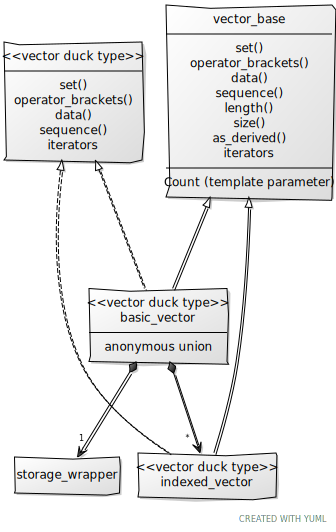

# Details

## How The Vectors Work

There are really two vector classes: **basic_vector** and **indexed_vector**. ```basic_vector``` is what you would normally think of as a contiguously stored vector/point representation. ```indexed_vector``` is a view on ```basic_vector```, which may only be modified under certain conditions.

A ```basic_vector``` has data members that provide [swizzling](https://en.wikipedia.org/wiki/Swizzling_(computer_graphics)). These swizzling data members are of type ```indexed_vector```, and this is where they are a view on the owning ```basic_vector```. Only the ```indexed_vector```s that do not have duplicate indexes in the swizzle are modifiable, e.g., ```foo.xzy``` is modifiable, while ```foo.zzy``` is not modifiable. Either way, an ```indexed_vector``` from a swizzle has a lifetime tied to the lifetime of the ```basic_vector``` it came from.

We want to use both types of vectors in the same way, for constructors, equality comparison, assignment, operators, compound assignment, vector functions, etc. Instead of duplicating this effort, ```basic_vector``` and ```indexed_vector``` derive from a [CRTP](https://en.wikipedia.org/wiki/Curiously_recurring_template_pattern) base class called **vector_base**, and this provides the generic foundation for constructors, equality comparison, assignment, operators, compound assignment, vector functions, etc:


```vector_base``` assumes that its derived structs and classes implement the **vector duck type** interface, which is not a real code interface, just more of a conceptual [duck typing](https://en.wikipedia.org/wiki/Duck_typing) idea (determined at compile time). Both ```basic_vector``` and ```indexed_vector``` implement this conceptual interface. ```storage_wrapper``` copies much of its interface from ```vector_base```, but there is no formal inheritance of this interface.

```vector_base``` carries the following information, via template parameters:
* Whether it can inherently be modified, i.e., **is it writable**. All ```basic_vector```s are **writable**, but not all ```indexed_vector```s. This is unrelated to ```const```.
* The **type of the data** in the vector (some arithmetic type).
* How many elements are in the vector (1-4), i.e., the **Count**.
* The **type of the derived class**.

It provides the following functions that can be used to generically manipulate and access vector data:
* **set()** - relies on CRTP ```set()```, which sets all the data in the vector to new values. Since this modifies the data, it is only enabled if it is writable. This function helps prevent aliasing issues that might occur otherwise, e.g., ```foo = foo.zyx;``` could have a problem with a naive implementation.
* **operator[]** - relies on CRTP ```operator[]```, which is a reference to a single data value. If writable then can use as an lvalue. The data is in logical order.
* **data()** - provides pointer to data access via CRTP ```data()```. If it is writable, then can use pointer to write data. Pointer access is in physical order.
* **sequence()** - relies on CRTP ```sequence()```. The physical order to logical order mapping in a parameter pack.
* **iterator functions** - relies on CRTP ```begin()```, ```crend()```, etc.
*  **length()** - relies on ```Count``` template parameter, and it returns type ```int```.
* **size()** - relies on ```Count``` template parameter, and it returns type ```std::size_t```.
* **as_derived()** - relies on the type of the derived class - useful for returning derived references to ```this``` when you just have a ```vector_base```.

## Inside basic_vector

```c++
template <dimensional_scalar T, std::size_t Size>
struct basic_vector;
```

Since we wanted to use notation such as ```foo.xy``` to access swizzles, the swizzled items must obviously be data members; however, there are many possible swizzles, increasing dramatically for the vector length 4 case (340 swizzles!). We don't want the ```sizeof``` ```basic_vector``` to grow, and the only way to be able to add many data members without the ```sizeof``` a class/struct growing is through a union. Since we don't want to have an intermediate name for access, it must be an **anonymous union**.

To get what we want, each member of the union must share a common intial sequence. The anonymous union for each struct is made up of one member of type **storage_wrapper** and many swizzled ```indexed_vector```s, the number depending on the length of the vector. We have tests (using the function ```std::is_corresponding_member()```) that confirm that these all share a **common initial sequence**. Both ```storage_wrapper``` and the ```indexed_vector```s have the same storage type (for now it is a ```std::array```), and the ```sizeof``` the array is the ```sizeof``` the ```basic_vector```.

```basic_vector``` member functions and constructors do all their data access through the ```storage_wrapper``` data member. It is also used as the *initialized* anonymous union member. For constexpr variables with anonymous unions, one and only one member must be initialized and/or accessed at compile time, and for us it is the one of type ```storage_wrapper```.

Since we are using a union where everything has the same common initial sequence, the data is shared and accessible for all the union members without having the restrictions that other unions have (otherwise the active union data member must be written to before being read from), and everything has the same lifetime as the ```basic_vector``` they come from.

## Inside indexed_vector

```c++
template <dimensional_scalar T, std::size_t Size, std::size_t Count, std::size_t ...Is>
struct indexed_vector;
```

```indexed_vector``` is the heart of swizzling. For a union where everything has the same common initial sequence, everything uses the same storage. ```indexed_vector``` therefore has a **Size**, which is the size of the underlying storage, and it has a **Count**, which is the number of elements it represents in the swizzle.

For example, if you had a length 4 vector ```v```, and you swizzled it like ```v.yzx```, then the ```indexed_vector``` for ```yzx``` has a Size == 4 (the same size as the length 4 vector), and it has a Count == 3, since we swizzled three ordinates.

The swizzle decides how to index into the storage. Continuing this example, ```yzx``` has three indices: [1, 2, 0]. This is how the values are looked up in the length 4 storage. The size, count, underlying type stored in the vector, and the indices for the swizzle are all passed as template parameters to ```indexed_vector```.

```c++
// some members that might be found in the basic_vector<T, 4u> anonymous union:

union
{
    storage_wrapper<T, 4u>                      base;

    indexed_vector<T, 4u, 1u, 0u>               x;      // Writable
    indexed_vector<T, 4u, 1u, 1u>               y;      // Writable
    indexed_vector<T, 4u, 1u, 2u>               z;      // Writable
    ...
    indexed_vector<T, 4u, 2u, 1u, 0u>           yx;     // Writable
    indexed_vector<T, 4u, 2u, 1u, 1u>           yy;
    indexed_vector<T, 4u, 2u, 1u, 2u>           yz;     // Writable
    ...
    indexed_vector<T, 4u, 3u, 1u, 1u, 2u>       yyz;
    indexed_vector<T, 4u, 3u, 1u, 2u, 0u>       yzx;    // Writable
    indexed_vector<T, 4u, 3u, 1u, 2u, 1u>       yzy;
    ...
    indexed_vector<T, 4u, 4u, 0u, 3u, 1u, 1u>   xwyy;
    indexed_vector<T, 4u, 4u, 0u, 3u, 1u, 2u>   xwyz;   // Writable
    indexed_vector<T, 4u, 4u, 0u, 3u, 1u, 3u>   xwyw;
    ...
};
```

```operator []``` and ```set()``` (and of course ```at()``` and ```init()```) all take into account the indirect index access, so it manages the logical sequential nature of the vector.

Only a non-const ```indexed_vector``` that has unique indices, e.g., [3, 2, 0], as opposed to repeating indices, e.g., [1, 2, 1], is **writable**, which means it can be used as an lvalue for assignment, or you can modify it via its member functions.

If you write a function that takes a ```basic_vector``` as a parameter, passing in an ```indexed_vector``` will not work. You either need to write the function to take a ```vector_base```, wrap the ```indexed_vector``` argument in a ```basic_vector``` constructor, or alternately use the unary ```operator +()``` on the ```indexed_vector``` argument, which will create a ```basic_vector``` from the ```indexed_vector```.

```indexed_vector``` is intended as a **view** on a ```basic_vector```; however, it is possible to create a stand-alone ```indexed_vector```. This can be done by copying a swizzle, (e.g., ```auto some_vec = other_vec.zxy;```) or directly declaring a variable. These are zero initializable (i.e., ```{}```) or can be initialized via desginated initalizer (e.g., ```{.base = {1, 2, 3}}```, although this doesn't seem to work for gcc). It is hard to see why anyone would want to explicitly create a stand-alone ```indexed_vector``` when they could use ```basic_vector```.

## Inside vector_base

```c++
template <bool Writable, dimensional_scalar T, std::size_t Count, typename Derived>
struct vector_base;
```

```vector_base``` is fairly well described above. It has no data members of its own, relying on the derived types for storage. It relies on derived types implementing the "vector duck type" interface, but the only enforcement there would be compile errors if they didn't. A ```c++20``` concept was attempted to check for the "vector duck type" interface, but not much time was spent on making it work, so it was abandoned. We may try again to create such a concept.

We want operations and functions to work the same on a ```basic_vector``` or a swizzle of one of these vectors (```indexed_vector```), and ```vector_base``` was created to give a common type for all the functions and operators to work with. This cuts our code in half, eliminating that redundancy. There are situations where we need to be explicit with ```basic_vector``` and ```indexed_vector```, supplying functions aimed specifically at the derived vector classes, i.e., ```isnan()``` and ```isinf()```, but that is not the norm.

We have also added some of the member functions found in the ```std::valarray``` API. We want these to work with both vector types, and since we can use the functions already in ```vector_base```, they are implemented here instead of the derived vector structs:

* ```apply()```
* ```shift()```
* ```cshift()```
* ```min()```
* ```max()```
* ```sum()```

## Inside "vector duck type"

Since ```vector_base``` is a CRTP base class, this imaginary interface provides functionality by directly invoking the derived class's versions of some interface functions:

* ```set()``` - used by ```set()```
* ```operator []``` - used by ```operator []```
* ```data()``` - used by ```data()```
* ```sequence()``` - used by ```sequence()```
* all the iterator variations, e.g., ```begin()```, ```end()```, ```crbegin()```, etc.

This interface is what allows the CRTP nature of this class/struct relationship to work.

## Inside storage_wrapper

```c++
template <dimensional_scalar T, std::size_t Size>
struct storage_wrapper;
```

For the anonymous union inside ```basic_vector```, we needed a way to change values at the top level, not through a swizzle. Also, an anonymous union can and must initialize and access one and only one union member at compile time, so this is necessary for constexpr variables of ```basic_vector```. We could have picked any of the swizzles (although ```xyzw``` for length 4 vectors seems most appropriate) to be the data member that is manipulated and accessed above the swizzle level, but as long as we create a variable of a type that shares a common initial sequence, it doesn't matter, as it won't grow the size of ```basic_vector``` and can share values through the common initial sequence.

```storage_wrapper``` can do pretty much all the things that ```vector_base``` can, but it can also be stand-alone. If one wanted, they could create an instance of one, initializing it via aggregate methods; however, there seems to be no compelling reason to create one of these stand-alone as one can have a ```basic_vector```, which is more powerful.

## How Matrix Works

```basic_matrix``` is a pretty simple type, all thing considered. It is just an array of column ```basic_vector```s, and associated operators and functions for performing matrix operations. Use ```operator []``` to access columns and use ```row()``` to access rows. Individual elements can be accessed like a two-dimensional array: ```mat[col_num][row_num]```. That is about it.

## Inside basic_matrix

```c++
template <floating_point_scalar T, std::size_t Cols, std::size_t Rows>
struct basic_matrix;
```

The most interesting thing about ```basic_matrix``` is that there is no preferred point of view of the matrix. From a linear algebraic point of view, we can both pre-multiply or post-multiply a vector and matrix. If a matrix represents a transformation, there is no inherent left-handed world vs right-handed world. A user of the library can have a point of view about how matrices should work for their project, and they can impose whatever constraints they desire, but ```basic_matrix``` doesn't force them down any particular path.

Since the underlying representation is an array of column vectors, it makes post-multiplying a vector with a matrix slightly more efficient (vector * matrix), due to treating the vector as a row vector for that multiplication, but that is not likely to make a difference in the long run.

## Detailed Generic Example

At the top of the [README](../README.md), there is a quick example of evaluating a cubic bezier curve for 2D points that uses float as the type of the vector elements. This works great as a one-off example, but what if one cares to generalize this as part of a library? What if it is desired to work directly with swizzles? In this case, ```vector_base``` will be the generic hook.

Now the control points can use any of the floating-point types, and they can have any number of elements that are allowed for the vector types. The return value will be a vector with the same floating-point type and same number of elements.

```c++
//
// quadratic bezier evaluator
//

// recursive interpolation approach to show off vector functions and swizzling
template <bool W, dsga::floating_point_scalar T, typename D>
constexpr auto quadratic_bezier_ordinate_eval(const dsga::vector_base<W, T, 3u, D> &control_points, T t) noexcept
{
    // not sure of real type of control_points, so make a basic_vector so we can swizzle
    auto quadratic_control_points = dsga::basic_vector<T, 3u>(control_points);

    auto linear_control_points = dsga::mix(quadratic_control_points.xy, quadratic_control_points.yz, t);
    return dsga::mix(linear_control_points.x, linear_control_points.y, t);
}

// given 3 control points and a t value (hopefully in the [0, 1] interval), evaluate the quadratic bezier function
template <bool W1, dsga::floating_point_scalar T, std::size_t C, typename D1,
 bool W2, typename D2, bool W3, typename D3>
requires (C > 1u)
constexpr auto quadratic_bezier_eval(const dsga::vector_base<W1, T, C, D1> &p0,
                                     const dsga::vector_base<W2, T, C, D2> &p1,
                                     const dsga::vector_base<W3, T, C, D3> &p2,
                                     T t) noexcept
{
    // a matrix will make it easier to get all the ordinate values in the rows
    dsga::basic_matrix<T, 3u, C> coord_matrix(p0, p1, p2);

    // lambda pack wrapper
    return [&]<std::size_t ...Is>(std::index_sequence<Is...>) noexcept
    {
        // evaluate the bezier function for each ordinate (i.e., row of control points)
        return dsga::basic_vector<T, C>(quadratic_bezier_ordinate_eval(coord_matrix.row(Is), t)...);
    }(std::make_index_sequence<C>{});
}

// same as previous function, but specializing for length 1 vector case
template <bool W1, dsga::floating_point_scalar T, std::size_t C, typename D1,
    bool W2, typename D2, bool W3, typename D3>
constexpr auto quadratic_bezier_eval(const dsga::vector_base<W1, T, 1u, D1> &p0,
                                     const dsga::vector_base<W2, T, 1u, D2> &p1,
                                     const dsga::vector_base<W3, T, 1u, D3> &p2,
                                     T t) noexcept
{
    // since the arguments are all length 1, we can't create a matrix and do the lambda pack wrapper,
    // so we directly invoke the evaluator for the one ordinate
    return quadratic_bezier_ordinate_eval(dsga::basic_vector<T, 3u>(p0, p1, p2), t);
}

//
// cubic bezier evaluator
//

// recursive interpolation approach to show off vector functions and swizzling
template <bool W, dsga::floating_point_scalar T, typename D>
constexpr auto cubic_bezier_ordinate_eval(const dsga::vector_base<W, T, 4u, D> &control_points, T t) noexcept
{
    // not sure of real type of control_points, so make a basic_vector so we can swizzle
    auto cubic_control_points = dsga::basic_vector<T, 4u>(control_points);

    auto quadratic_control_points = dsga::mix(cubic_control_points.xyz, cubic_control_points.yzw, t);
    auto linear_control_points = dsga::mix(quadratic_control_points.xy, quadratic_control_points.yz, t);
    return dsga::mix(linear_control_points.x, linear_control_points.y, t);
}

// given 4 control points and a t value (hopefully in the [0, 1] interval), evaluate the cubic bezier function
template <bool W1, dsga::floating_point_scalar T, std::size_t C, typename D1,
    bool W2, typename D2, bool W3, typename D3, bool W4, typename D4>
requires (C > 1u)
constexpr auto cubic_bezier_eval(const dsga::vector_base<W1, T, C, D1> &p0,
                                 const dsga::vector_base<W2, T, C, D2> &p1,
                                 const dsga::vector_base<W3, T, C, D3> &p2,
                                 const dsga::vector_base<W4, T, C, D4> &p3,
                                 T t) noexcept
{
    // a matrix will make it easier to get all the ordinate values in the rows
    auto coord_matrix = dsga::basic_matrix<T, 4u, C>(p0, p1, p2, p3);

    // lambda pack wrapper
    return [&]<std::size_t ...Is>(std::index_sequence<Is...>) noexcept
    {
        // evaluate the bezier function for each ordinate (i.e., row of control points)
        return dsga::basic_vector<T, C>(cubic_bezier_ordinate_eval(coord_matrix.row(Is), t)...);
    }(std::make_index_sequence<C>{});
}

// same as previous function, but specializing for length 1 vector case
template <bool W1, dsga::floating_point_scalar T, std::size_t C, typename D1,
    bool W2, typename D2, bool W3, typename D3, bool W4, typename D4>
constexpr auto cubic_bezier_eval(const dsga::vector_base<W1, T, 1u, D1> &p0,
                                 const dsga::vector_base<W2, T, 1u, D2> &p1,
                                 const dsga::vector_base<W3, T, 1u, D3> &p2,
                                 const dsga::vector_base<W4, T, 1u, D4> &p3,
                                 T t) noexcept
{
    // since the arguments are all length 1, we can't create a matrix and do the lambda pack wrapper,
    // so we directly invoke the evaluator for the one ordinate
    return cubic_bezier_ordinate_eval(dsga::basic_vector<T, 4u>(p0, p1, p2, p3), t);
}
```